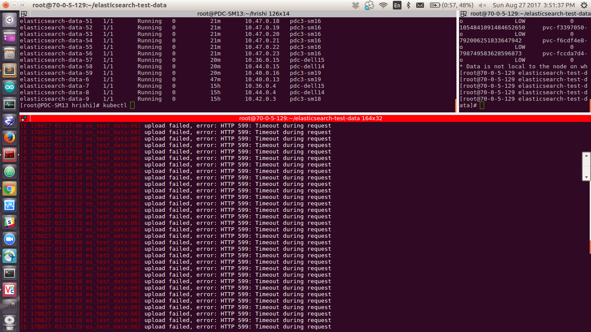
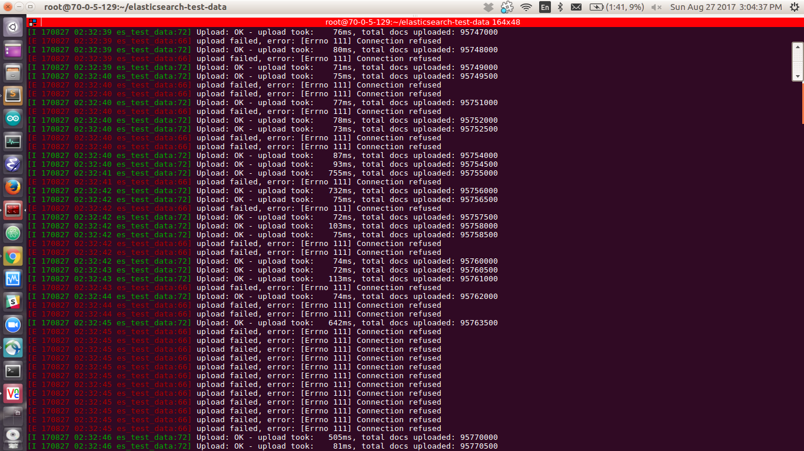

Version of PX before. 
```
/opt/pwx/bin/pxctl -v
pxctl version 1.2.9-48d2568
```

Version of PX using the vilas/px:1.2.9 image
```
/opt/pwx/bin/pxctl -v
pxctl version 1.2.9-34a0276
```

5 node ES Cluster
```
kubectl get pods -l "component=elasticsearch,role=data" -w
NAME                   READY     STATUS            RESTARTS   AGE
elasticsearch-data-0   0/1       PodInitializing   0          12s
elasticsearch-data-0   1/1       Running   0         13s
elasticsearch-data-1   0/1       Pending   0         0s
elasticsearch-data-1   0/1       Pending   0         0s
elasticsearch-data-1   0/1       Pending   0         3s
elasticsearch-data-1   0/1       Init:0/1   0         3s
elasticsearch-data-1   0/1       PodInitializing   0         6s
elasticsearch-data-1   1/1       Running   0         9s
elasticsearch-data-2   0/1       Pending   0         0s
elasticsearch-data-2   0/1       Pending   0         0s
elasticsearch-data-2   0/1       Pending   0         3s
elasticsearch-data-2   0/1       Init:0/1   0         3s
elasticsearch-data-2   0/1       PodInitializing   0         5s
elasticsearch-data-2   1/1       Running   0         11s
elasticsearch-data-3   0/1       Pending   0         0s
elasticsearch-data-3   0/1       Pending   0         0s
elasticsearch-data-3   0/1       Pending   0         7s
elasticsearch-data-3   0/1       Init:0/1   0         7s
elasticsearch-data-3   0/1       PodInitializing   0         10s
elasticsearch-data-3   1/1       Running   0         15s
elasticsearch-data-4   0/1       Pending   0         0s
elasticsearch-data-4   0/1       Pending   0         0s
elasticsearch-data-4   0/1       Pending   0         3s
elasticsearch-data-4   0/1       Init:0/1   0         3s
elasticsearch-data-4   0/1       PodInitializing   0         5s
elasticsearch-data-4   1/1       Running   0         10s
```

```
/opt/pwx/bin/pxctl v l
ID			NAME						SIZE	HA	SHARED	ENCRYPTED	IO_PRIORITY	SCALE	STATUS
898306465977508703	pvc-d6cbb981-8a54-11e7-8556-ac1f6b2024cc	80 GiB	2	no	no		LOW		0	up - attached on 70.0.0.87 *
536129438615373168	pvc-decac7b9-8a54-11e7-8556-ac1f6b2024cc	80 GiB	2	no	no		LOW		0	up - attached on 70.0.0.86 *
345122177941294058	pvc-e3e1784a-8a54-11e7-8556-ac1f6b2024cc	80 GiB	2	no	no		LOW		0	up - attached on 70.0.0.82
973219352009010114	pvc-ea4488ed-8a54-11e7-8556-ac1f6b2024cc	80 GiB	2	no	no		LOW		0	up - attached on 70.0.0.84 *
1054841091484652650	pvc-f3397050-8a54-11e7-8556-ac1f6b2024cc	80 GiB	2	no	no		LOW		0	up - attached on 70.0.0.83
* Data is not local to the node on which volume is attached.

curl 'http://10.105.105.41:9200/_cat/nodes?v'
ip        heap.percent ram.percent cpu load_1m load_5m load_15m node.role master name
10.40.0.2           49          14   0    0.33    0.34     0.27 m         *      es-master-2996564765-zj0gc
10.40.0.3           37          14   0    0.33    0.34     0.27 d         -      elasticsearch-data-0
10.42.0.2           36          14   0    0.15    0.14     0.14 d         -      elasticsearch-data-1
10.36.0.2           35          19   0    0.23    0.16     0.16 d         -      elasticsearch-data-4
10.44.0.3           37          39   0    0.87    0.29     0.19 d         -      elasticsearch-data-2
10.47.0.4           36          19   0    0.29    0.19     0.15 d         -      elasticsearch-data-3
10.47.0.2           54          19   0    0.29    0.19     0.15 m         -      es-master-2996564765-rql6m
10.44.0.2           56          39   0    0.87    0.29     0.19 m         -      es-master-2996564765-4c56v
10.36.0.1           56          19   0    0.23    0.16     0.16 i         -      es-client-2155074821-v0w31
10.47.0.3           46          19   0    0.29    0.19     0.15 i         -      es-client-2155074821-nxdkt
```

Scaling to 50 nodes
```
kubectl get pods -l "component=elasticsearch,role=data"
NAME                    READY     STATUS    RESTARTS   AGE
elasticsearch-data-0    1/1       Running   0          13m
elasticsearch-data-1    1/1       Running   0          13m
elasticsearch-data-10   1/1       Running   0          7m
elasticsearch-data-11   1/1       Running   0          7m
elasticsearch-data-12   1/1       Running   0          6m
elasticsearch-data-13   1/1       Running   0          6m
elasticsearch-data-14   1/1       Running   0          6m
elasticsearch-data-15   1/1       Running   0          6m
elasticsearch-data-16   1/1       Running   0          6m
elasticsearch-data-17   1/1       Running   0          6m
elasticsearch-data-18   1/1       Running   0          5m
elasticsearch-data-19   1/1       Running   0          5m
elasticsearch-data-2    1/1       Running   0          12m
elasticsearch-data-20   1/1       Running   0          5m
elasticsearch-data-21   1/1       Running   0          5m
elasticsearch-data-22   1/1       Running   0          5m
elasticsearch-data-23   1/1       Running   0          5m
elasticsearch-data-24   1/1       Running   0          4m
elasticsearch-data-25   1/1       Running   0          4m
elasticsearch-data-26   1/1       Running   0          4m
elasticsearch-data-27   1/1       Running   0          4m
elasticsearch-data-28   1/1       Running   0          4m
elasticsearch-data-29   1/1       Running   0          3m
elasticsearch-data-3    1/1       Running   0          12m
elasticsearch-data-30   1/1       Running   0          3m
elasticsearch-data-31   1/1       Running   0          3m
elasticsearch-data-32   1/1       Running   0          3m
elasticsearch-data-33   1/1       Running   0          3m
elasticsearch-data-34   1/1       Running   0          3m
elasticsearch-data-35   1/1       Running   0          2m
elasticsearch-data-36   1/1       Running   0          2m
elasticsearch-data-37   1/1       Running   0          2m
elasticsearch-data-38   1/1       Running   0          2m
elasticsearch-data-39   1/1       Running   0          2m
elasticsearch-data-4    1/1       Running   0          12m
elasticsearch-data-40   1/1       Running   0          1m
elasticsearch-data-41   1/1       Running   0          1m
elasticsearch-data-42   1/1       Running   0          1m
elasticsearch-data-43   1/1       Running   0          1m
elasticsearch-data-44   1/1       Running   0          1m
elasticsearch-data-45   1/1       Running   0          50s
elasticsearch-data-46   1/1       Running   0          40s
elasticsearch-data-47   1/1       Running   0          30s
elasticsearch-data-48   1/1       Running   0          15s
elasticsearch-data-49   0/1       Pending   0          5s
elasticsearch-data-5    1/1       Running   0          8m
elasticsearch-data-6    1/1       Running   0          8m
elasticsearch-data-7    1/1       Running   0          7m
elasticsearch-data-8    1/1       Running   0          7m
elasticsearch-data-9    1/1       Running   0          7m
```

```
/opt/pwx/bin/pxctl v l
ID			NAME						SIZE	HA	SHARED	ENCRYPTED	IO_PRIORITY	SCALE	STATUS
734574533613054662	pvc-05812eb2-8a56-11e7-8556-ac1f6b2024cc	80 GiB	2	no	no		LOW		0	up - attached on 70.0.0.82 *
893982597961200811	pvc-0b25f9d8-8a56-11e7-8556-ac1f6b2024cc	80 GiB	2	no	no		LOW		0	up - attached on 70.0.0.87
724749555501756158	pvc-1102d7c3-8a56-11e7-8556-ac1f6b2024cc	80 GiB	2	no	no		LOW		0	up - attached on 70.0.0.84 *
876791005775303298	pvc-17149238-8a56-11e7-8556-ac1f6b2024cc	80 GiB	2	no	no		LOW		0	up - attached on 70.0.0.86
125709934439789499	pvc-1c9a233d-8a56-11e7-8556-ac1f6b2024cc	80 GiB	2	no	no		LOW		0	up - attached on 70.0.0.82 *
872730838581280878	pvc-223d06fc-8a56-11e7-8556-ac1f6b2024cc	80 GiB	2	no	no		LOW		0	up - attached on 70.0.0.83
171356638174283466	pvc-2d3e348e-8a56-11e7-8556-ac1f6b2024cc	80 GiB	2	no	no		LOW		0	up - attached on 70.0.0.87 *
754553482914883909	pvc-32537501-8a56-11e7-8556-ac1f6b2024cc	80 GiB	2	no	no		LOW		0	up - attached on 70.0.0.83 *
427939063269639877	pvc-37bdbf82-8a56-11e7-8556-ac1f6b2024cc	80 GiB	2	no	no		LOW		0	up - attached on 70.0.0.82
116457846922004719	pvc-3e1dd52b-8a56-11e7-8556-ac1f6b2024cc	80 GiB	2	no	no		LOW		0	up - attached on 70.0.0.86 *
1139954777490411891	pvc-43a16954-8a56-11e7-8556-ac1f6b2024cc	80 GiB	2	no	no		LOW		0	up - attached on 70.0.0.84
150060581296577188	pvc-4c000d36-8a56-11e7-8556-ac1f6b2024cc	80 GiB	2	no	no		LOW		0	up - attached on 70.0.0.87
814943080410107072	pvc-53da431d-8a56-11e7-8556-ac1f6b2024cc	80 GiB	2	no	no		LOW		0	up - attached on 70.0.0.82 *
686620579164076226	pvc-5c6f2371-8a56-11e7-8556-ac1f6b2024cc	80 GiB	2	no	no		LOW		0	up - attached on 70.0.0.84 *
174529398250491564	pvc-63b740ad-8a56-11e7-8556-ac1f6b2024cc	80 GiB	2	no	no		LOW		0	up - attached on 70.0.0.83 *
960529151372803490	pvc-6977b3b6-8a56-11e7-8556-ac1f6b2024cc	80 GiB	2	no	no		LOW		0	up - attached on 70.0.0.86 *
125473242983551582	pvc-6eee1b96-8a56-11e7-8556-ac1f6b2024cc	80 GiB	2	no	no		LOW		0	up - attached on 70.0.0.87 *
477988990037675673	pvc-74c430a0-8a56-11e7-8556-ac1f6b2024cc	80 GiB	2	no	no		LOW		0	up - attached on 70.0.0.86 *
1110816147477960158	pvc-7cd27e71-8a56-11e7-8556-ac1f6b2024cc	80 GiB	2	no	no		LOW		0	up - attached on 70.0.0.84 *
250647254202813600	pvc-82e6bf12-8a56-11e7-8556-ac1f6b2024cc	80 GiB	2	no	no		LOW		0	up - attached on 70.0.0.83 *
277210882846985864	pvc-891d7553-8a55-11e7-8556-ac1f6b2024cc	80 GiB	2	no	no		LOW		0	up - attached on 70.0.0.87 *
877474250365270990	pvc-8ae9f185-8a56-11e7-8556-ac1f6b2024cc	80 GiB	2	no	no		LOW		0	up - attached on 70.0.0.82
7431685130093850	pvc-924838ec-8a55-11e7-8556-ac1f6b2024cc	80 GiB	2	no	no		LOW		0	up - attached on 70.0.0.84
268917918480762330	pvc-9323aa0e-8a56-11e7-8556-ac1f6b2024cc	80 GiB	2	no	no		LOW		0	up - attached on 70.0.0.87
862352333542952633	pvc-97ccd60a-8a55-11e7-8556-ac1f6b2024cc	80 GiB	2	no	no		LOW		0	up - attached on 70.0.0.83 *
1023162587516954684	pvc-98efa762-8a56-11e7-8556-ac1f6b2024cc	80 GiB	2	no	no		LOW		0	up - attached on 70.0.0.84 *
307372795259710479	pvc-9e4a8ce6-8a55-11e7-8556-ac1f6b2024cc	80 GiB	2	no	no		LOW		0	up - attached on 70.0.0.82
249213593303028072	pvc-9ee47199-8a56-11e7-8556-ac1f6b2024cc	80 GiB	2	no	no		LOW		0	up - attached on 70.0.0.82
357351658688572827	pvc-a61d36fb-8a55-11e7-8556-ac1f6b2024cc	80 GiB	2	no	no		LOW		0	up - attached on 70.0.0.86 *
102377685331166474	pvc-a7f51d48-8a56-11e7-8556-ac1f6b2024cc	80 GiB	2	no	no		LOW		0	up - attached on 70.0.0.83 *
700035339727098384	pvc-ab338668-8a55-11e7-8556-ac1f6b2024cc	80 GiB	2	no	no		LOW		0	up - attached on 70.0.0.87 *
293118662604800478	pvc-ad909c8b-8a56-11e7-8556-ac1f6b2024cc	80 GiB	2	no	no		LOW		0	up - attached on 70.0.0.86 *
389093283263383239	pvc-b1e176ab-8a55-11e7-8556-ac1f6b2024cc	80 GiB	2	no	no		LOW		0	up - attached on 70.0.0.83 *
743700292549576311	pvc-b97004b4-8a55-11e7-8556-ac1f6b2024cc	80 GiB	2	no	no		LOW		0	up - attached on 70.0.0.86
319853829604696397	pvc-bf967793-8a55-11e7-8556-ac1f6b2024cc	80 GiB	2	no	no		LOW		0	up - attached on 70.0.0.84 *
1054767029638280482	pvc-c52225e6-8a55-11e7-8556-ac1f6b2024cc	80 GiB	2	no	no		LOW		0	up - attached on 70.0.0.82
370887492121225235	pvc-cb85ab44-8a55-11e7-8556-ac1f6b2024cc	80 GiB	2	no	no		LOW		0	up - attached on 70.0.0.87 *
1084784791274055120	pvc-d152159f-8a55-11e7-8556-ac1f6b2024cc	80 GiB	2	no	no		LOW		0	up - attached on 70.0.0.82 *
922689016087262905	pvc-d66a85c6-8a55-11e7-8556-ac1f6b2024cc	80 GiB	2	no	no		LOW		0	up - attached on 70.0.0.83 *
898306465977508703	pvc-d6cbb981-8a54-11e7-8556-ac1f6b2024cc	80 GiB	2	no	no		LOW		0	up - attached on 70.0.0.87 *
9408376402623943	pvc-de65fed3-8a55-11e7-8556-ac1f6b2024cc	80 GiB	2	no	no		LOW		0	up - attached on 70.0.0.84 *
536129438615373168	pvc-decac7b9-8a54-11e7-8556-ac1f6b2024cc	80 GiB	2	no	no		LOW		0	up - attached on 70.0.0.86 *
345122177941294058	pvc-e3e1784a-8a54-11e7-8556-ac1f6b2024cc	80 GiB	2	no	no		LOW		0	up - attached on 70.0.0.82
757415091075175272	pvc-e40d1fe5-8a55-11e7-8556-ac1f6b2024cc	80 GiB	2	no	no		LOW		0	up - attached on 70.0.0.86
376683919619193435	pvc-e8f5ca47-8a55-11e7-8556-ac1f6b2024cc	80 GiB	2	no	no		LOW		0	up - attached on 70.0.0.87
973219352009010114	pvc-ea4488ed-8a54-11e7-8556-ac1f6b2024cc	80 GiB	2	no	no		LOW		0	up - attached on 70.0.0.84 *
975905045065373299	pvc-ef15225a-8a55-11e7-8556-ac1f6b2024cc	80 GiB	2	no	no		LOW		0	up - attached on 70.0.0.86
1054841091484652650	pvc-f3397050-8a54-11e7-8556-ac1f6b2024cc	80 GiB	2	no	no		LOW		0	up - attached on 70.0.0.83
792006251833647942	pvc-f6cdf4e8-8a55-11e7-8556-ac1f6b2024cc	80 GiB	2	no	no		LOW		0	up - attached on 70.0.0.83 *
798749583628596873	pvc-fccda7d4-8a55-11e7-8556-ac1f6b2024cc	80 GiB	2	no	no		LOW		0	up - attached on 70.0.0.84 *
* Data is not local to the node on which volume is attached.

```

```
kubectl get pvc
NAME                               STATUS    VOLUME                                     CAPACITY   ACCESSMODES   STORAGECLASS   AGE
px-storage-elasticsearch-data-0    Bound     pvc-d6cbb981-8a54-11e7-8556-ac1f6b2024cc   80Gi       RWO           px-data-sc     17m
px-storage-elasticsearch-data-1    Bound     pvc-decac7b9-8a54-11e7-8556-ac1f6b2024cc   80Gi       RWO           px-data-sc     17m
px-storage-elasticsearch-data-10   Bound     pvc-ab338668-8a55-11e7-8556-ac1f6b2024cc   80Gi       RWO           px-data-sc     11m
px-storage-elasticsearch-data-11   Bound     pvc-b1e176ab-8a55-11e7-8556-ac1f6b2024cc   80Gi       RWO           px-data-sc     11m
px-storage-elasticsearch-data-12   Bound     pvc-b97004b4-8a55-11e7-8556-ac1f6b2024cc   80Gi       RWO           px-data-sc     11m
px-storage-elasticsearch-data-13   Bound     pvc-bf967793-8a55-11e7-8556-ac1f6b2024cc   80Gi       RWO           px-data-sc     11m
px-storage-elasticsearch-data-14   Bound     pvc-c52225e6-8a55-11e7-8556-ac1f6b2024cc   80Gi       RWO           px-data-sc     10m
px-storage-elasticsearch-data-15   Bound     pvc-cb85ab44-8a55-11e7-8556-ac1f6b2024cc   80Gi       RWO           px-data-sc     10m
px-storage-elasticsearch-data-16   Bound     pvc-d152159f-8a55-11e7-8556-ac1f6b2024cc   80Gi       RWO           px-data-sc     10m
px-storage-elasticsearch-data-17   Bound     pvc-d66a85c6-8a55-11e7-8556-ac1f6b2024cc   80Gi       RWO           px-data-sc     10m
px-storage-elasticsearch-data-18   Bound     pvc-de65fed3-8a55-11e7-8556-ac1f6b2024cc   80Gi       RWO           px-data-sc     10m
px-storage-elasticsearch-data-19   Bound     pvc-e40d1fe5-8a55-11e7-8556-ac1f6b2024cc   80Gi       RWO           px-data-sc     10m
px-storage-elasticsearch-data-2    Bound     pvc-e3e1784a-8a54-11e7-8556-ac1f6b2024cc   80Gi       RWO           px-data-sc     17m
px-storage-elasticsearch-data-20   Bound     pvc-e8f5ca47-8a55-11e7-8556-ac1f6b2024cc   80Gi       RWO           px-data-sc     9m
px-storage-elasticsearch-data-21   Bound     pvc-ef15225a-8a55-11e7-8556-ac1f6b2024cc   80Gi       RWO           px-data-sc     9m
px-storage-elasticsearch-data-22   Bound     pvc-f6cdf4e8-8a55-11e7-8556-ac1f6b2024cc   80Gi       RWO           px-data-sc     9m
px-storage-elasticsearch-data-23   Bound     pvc-fccda7d4-8a55-11e7-8556-ac1f6b2024cc   80Gi       RWO           px-data-sc     9m
px-storage-elasticsearch-data-24   Bound     pvc-05812eb2-8a56-11e7-8556-ac1f6b2024cc   80Gi       RWO           px-data-sc     9m
px-storage-elasticsearch-data-25   Bound     pvc-0b25f9d8-8a56-11e7-8556-ac1f6b2024cc   80Gi       RWO           px-data-sc     8m
px-storage-elasticsearch-data-26   Bound     pvc-1102d7c3-8a56-11e7-8556-ac1f6b2024cc   80Gi       RWO           px-data-sc     8m
px-storage-elasticsearch-data-27   Bound     pvc-17149238-8a56-11e7-8556-ac1f6b2024cc   80Gi       RWO           px-data-sc     8m
px-storage-elasticsearch-data-28   Bound     pvc-1c9a233d-8a56-11e7-8556-ac1f6b2024cc   80Gi       RWO           px-data-sc     8m
px-storage-elasticsearch-data-29   Bound     pvc-223d06fc-8a56-11e7-8556-ac1f6b2024cc   80Gi       RWO           px-data-sc     8m
px-storage-elasticsearch-data-3    Bound     pvc-ea4488ed-8a54-11e7-8556-ac1f6b2024cc   80Gi       RWO           px-data-sc     17m
px-storage-elasticsearch-data-30   Bound     pvc-2d3e348e-8a56-11e7-8556-ac1f6b2024cc   80Gi       RWO           px-data-sc     8m
px-storage-elasticsearch-data-31   Bound     pvc-32537501-8a56-11e7-8556-ac1f6b2024cc   80Gi       RWO           px-data-sc     7m
px-storage-elasticsearch-data-32   Bound     pvc-37bdbf82-8a56-11e7-8556-ac1f6b2024cc   80Gi       RWO           px-data-sc     7m
px-storage-elasticsearch-data-33   Bound     pvc-3e1dd52b-8a56-11e7-8556-ac1f6b2024cc   80Gi       RWO           px-data-sc     7m
px-storage-elasticsearch-data-34   Bound     pvc-43a16954-8a56-11e7-8556-ac1f6b2024cc   80Gi       RWO           px-data-sc     7m
px-storage-elasticsearch-data-35   Bound     pvc-4c000d36-8a56-11e7-8556-ac1f6b2024cc   80Gi       RWO           px-data-sc     7m
px-storage-elasticsearch-data-36   Bound     pvc-53da431d-8a56-11e7-8556-ac1f6b2024cc   80Gi       RWO           px-data-sc     6m
px-storage-elasticsearch-data-37   Bound     pvc-5c6f2371-8a56-11e7-8556-ac1f6b2024cc   80Gi       RWO           px-data-sc     6m
px-storage-elasticsearch-data-38   Bound     pvc-63b740ad-8a56-11e7-8556-ac1f6b2024cc   80Gi       RWO           px-data-sc     6m
px-storage-elasticsearch-data-39   Bound     pvc-6977b3b6-8a56-11e7-8556-ac1f6b2024cc   80Gi       RWO           px-data-sc     6m
px-storage-elasticsearch-data-4    Bound     pvc-f3397050-8a54-11e7-8556-ac1f6b2024cc   80Gi       RWO           px-data-sc     16m
px-storage-elasticsearch-data-40   Bound     pvc-6eee1b96-8a56-11e7-8556-ac1f6b2024cc   80Gi       RWO           px-data-sc     6m
px-storage-elasticsearch-data-41   Bound     pvc-74c430a0-8a56-11e7-8556-ac1f6b2024cc   80Gi       RWO           px-data-sc     6m
px-storage-elasticsearch-data-42   Bound     pvc-7cd27e71-8a56-11e7-8556-ac1f6b2024cc   80Gi       RWO           px-data-sc     5m
px-storage-elasticsearch-data-43   Bound     pvc-82e6bf12-8a56-11e7-8556-ac1f6b2024cc   80Gi       RWO           px-data-sc     5m
px-storage-elasticsearch-data-44   Bound     pvc-8ae9f185-8a56-11e7-8556-ac1f6b2024cc   80Gi       RWO           px-data-sc     5m
px-storage-elasticsearch-data-45   Bound     pvc-9323aa0e-8a56-11e7-8556-ac1f6b2024cc   80Gi       RWO           px-data-sc     5m
px-storage-elasticsearch-data-46   Bound     pvc-98efa762-8a56-11e7-8556-ac1f6b2024cc   80Gi       RWO           px-data-sc     4m
px-storage-elasticsearch-data-47   Bound     pvc-9ee47199-8a56-11e7-8556-ac1f6b2024cc   80Gi       RWO           px-data-sc     4m
px-storage-elasticsearch-data-48   Bound     pvc-a7f51d48-8a56-11e7-8556-ac1f6b2024cc   80Gi       RWO           px-data-sc     4m
px-storage-elasticsearch-data-49   Bound     pvc-ad909c8b-8a56-11e7-8556-ac1f6b2024cc   80Gi       RWO           px-data-sc     4m
px-storage-elasticsearch-data-5    Bound     pvc-891d7553-8a55-11e7-8556-ac1f6b2024cc   80Gi       RWO           px-data-sc     12m
px-storage-elasticsearch-data-6    Bound     pvc-924838ec-8a55-11e7-8556-ac1f6b2024cc   80Gi       RWO           px-data-sc     12m
px-storage-elasticsearch-data-7    Bound     pvc-97ccd60a-8a55-11e7-8556-ac1f6b2024cc   80Gi       RWO           px-data-sc     12m
px-storage-elasticsearch-data-8    Bound     pvc-9e4a8ce6-8a55-11e7-8556-ac1f6b2024cc   80Gi       RWO           px-data-sc     11m
px-storage-elasticsearch-data-9    Bound     pvc-a61d36fb-8a55-11e7-8556-ac1f6b2024cc   80Gi       RWO           px-data-sc     11m
```

Start the Data load
```
python es_test_data.py --es_url=http://10.105.105.41:9200 --count=100000000 --batch-size=500
```

PX Cluster State 
```
/opt/pwx/bin/pxctl status
Status: PX is operational
License: Trial (expires in 14 days)
Node ID: pdc-dell14
	IP: 70.0.0.82 
 	Local Storage Pool: 1 pool
	POOL	IO_PRIORITY	RAID_LEVEL	USABLE	USED	STATUS	ZONE	REGION
	0	HIGH		raid0		118 GiB	24 GiB	Online	default	default
	Local Storage Devices: 1 device
	Device	Path		Media Type		Size		Last-Scan
	0:1	/dev/sdj	STORAGE_MEDIUM_SSD	118 GiB		26 Aug 17 10:44 PDT
	total			-			118 GiB
Cluster Summary
	Cluster ID: 11f78556-4d0f-4fd9-9b39-4b6a0174ELK
	Cluster UUID: f8d9fb09-4a20-4713-b55a-a53b3571e731
	IP		ID				Used	Capacity	Status
	70.0.0.84	pdc3-sm16			36 GiB	7.8 TiB		Online
	70.0.0.86	pdc3-sm18			36 GiB	7.8 TiB		Online
	70.0.0.82	pdc-dell14			24 GiB	118 GiB		Online (This node)
	70.0.0.87	pdc3-sm19			36 GiB	7.8 TiB		Online
	70.0.0.85	70-0-5-129.pools.spcsdns.net	36 GiB	7.8 TiB		Online
	70.0.0.83	pdc-dell15			36 GiB	7.8 TiB		Online
Global Storage Pool
	Total Used    	:  205 GiB
	Total Capacity	:  39 TiB
```

ES Cluster 
```
curl 'http://10.105.105.41:9200/_cat/nodes?v'
ip         heap.percent ram.percent cpu load_1m load_5m load_15m node.role master name
10.44.0.10           54          63   0    0.77    0.93     0.89 d         -      elasticsearch-data-36
10.44.0.9            57          63   0    0.77    0.93     0.89 d         -      elasticsearch-data-32
10.36.0.4            40          44   0    1.43    0.50     0.40 d         -      elasticsearch-data-7
10.44.0.3            44          63   0    0.77    0.93     0.89 d         -      elasticsearch-data-2
10.47.0.4            48          45   0    0.39    0.41     0.41 d         -      elasticsearch-data-3
10.40.0.9            60          39   1    1.43    1.76     1.46 d         -      elasticsearch-data-30
10.42.0.9            58          38   0    0.28    0.27     0.26 d         -      elasticsearch-data-39
10.36.0.2            45          44   0    1.43    0.50     0.40 d         -      elasticsearch-data-4
10.44.0.4            36          63   0    0.77    0.93     0.89 d         -      elasticsearch-data-8
10.36.0.12           55          44   0    1.43    0.50     0.40 d         -      elasticsearch-data-48
10.36.0.7            61          44   0    1.43    0.50     0.40 d         -      elasticsearch-data-22
10.36.0.8            60          44   0    1.43    0.50     0.40 d         -      elasticsearch-data-29
10.44.0.7            61          63   0    0.77    0.93     0.89 d         -      elasticsearch-data-24
10.42.0.2            45          38   0    0.28    0.27     0.26 d         -      elasticsearch-data-1
10.44.0.6            63          63   0    0.77    0.93     0.89 d         -      elasticsearch-data-16
10.42.0.3            40          38   0    0.28    0.27     0.26 d         -      elasticsearch-data-9
10.42.0.8            60          38   0    0.28    0.27     0.26 d         -      elasticsearch-data-33
10.47.0.2            59          45   0    0.39    0.41     0.41 m         -      es-master-2996564765-rql6m
10.36.0.9            60          44   0    1.43    0.50     0.40 d         -      elasticsearch-data-31
10.47.0.10           38          45   0    0.39    0.41     0.41 d         -      elasticsearch-data-34
10.40.0.3            44          39   1    1.43    1.76     1.46 d         -      elasticsearch-data-0
10.44.0.8            58          63   0    0.77    0.93     0.89 d         -      elasticsearch-data-28
10.47.0.7            42          45   0    0.39    0.41     0.41 d         -      elasticsearch-data-18
10.47.0.3            70          45   0    0.39    0.41     0.41 i         -      es-client-2155074821-nxdkt
10.36.0.5            40          44   0    1.43    0.50     0.40 d         -      elasticsearch-data-11
10.47.0.11           61          45   0    0.39    0.41     0.41 d         -      elasticsearch-data-37
10.40.0.4            42          39   1    1.43    1.76     1.46 d         -      elasticsearch-data-5
10.36.0.1            56          44   0    1.43    0.50     0.40 i         -      es-client-2155074821-v0w31
10.47.0.13           58          45   0    0.39    0.41     0.41 d         -      elasticsearch-data-46
10.44.0.5            65          63   0    0.77    0.93     0.89 d         -      elasticsearch-data-14
10.40.0.10           52          39   1    1.43    1.76     1.46 d         -      elasticsearch-data-35
10.47.0.9            40          45   0    0.39    0.41     0.41 d         -      elasticsearch-data-26
10.44.0.2            61          63   0    0.77    0.93     0.89 m         -      es-master-2996564765-4c56v
10.42.0.5            38          38   0    0.28    0.27     0.26 d         -      elasticsearch-data-19
10.36.0.10           58          44   0    1.43    0.50     0.40 d         -      elasticsearch-data-38
10.47.0.6            43          45   0    0.39    0.41     0.41 d         -      elasticsearch-data-13
10.40.0.8            61          39   1    1.43    1.76     1.46 d         -      elasticsearch-data-25
10.40.0.7            38          39   1    1.43    1.76     1.46 d         -      elasticsearch-data-20
10.36.0.11           57          44   0    1.43    0.50     0.40 d         -      elasticsearch-data-43
10.44.0.12           50          63   0    0.77    0.93     0.89 d         -      elasticsearch-data-47
10.40.0.2            38          39   1    1.43    1.76     1.46 m         *      es-master-2996564765-zj0gc
10.40.0.5            40          39   1    1.43    1.76     1.46 d         -      elasticsearch-data-10
10.40.0.6            39          39   1    1.43    1.76     1.46 d         -      elasticsearch-data-15
10.36.0.6            38          44   0    1.43    0.50     0.40 d         -      elasticsearch-data-17
10.42.0.11           55          38   0    0.28    0.27     0.26 d         -      elasticsearch-data-49
10.40.0.11           57          39   1    1.43    1.76     1.46 d         -      elasticsearch-data-40
10.47.0.5            45          45   0    0.39    0.41     0.41 d         -      elasticsearch-data-6
10.47.0.8            40          45   0    0.39    0.41     0.41 d         -      elasticsearch-data-23
10.47.0.12           60          45   0    0.39    0.41     0.41 d         -      elasticsearch-data-42
10.40.0.12           57          39   1    1.43    1.76     1.46 d         -      elasticsearch-data-45
10.42.0.7            60          38   0    0.28    0.27     0.26 d         -      elasticsearch-data-27
10.42.0.4            40          38   0    0.28    0.27     0.26 d         -      elasticsearch-data-12
10.44.0.11           50          63   0    0.77    0.93     0.89 d         -      elasticsearch-data-44
10.42.0.6            66          38   0    0.28    0.27     0.26 d         -      elasticsearch-data-21
10.42.0.10           57          38   0    0.28    0.27     0.26 d         -      elasticsearch-data-41
```

Pod Failover scenario - Delete the pod. 
```
kubectl get nodes
NAME                           STATUS                     AGE       VERSION
70-0-5-129.pools.spcsdns.net   Ready,SchedulingDisabled   23d       v1.7.2
pdc-dell14                     Ready                      24d       v1.7.2
pdc-dell15                     Ready                      24d       v1.7.2
pdc-sm13.portcolo.com          Ready                      24d       v1.7.2
pdc3-sm16                      Ready                      24d       v1.7.2
pdc3-sm18                      Ready                      24d       v1.7.2
pdc3-sm19                      Ready                      24d       v1.7.2

kubectl cordon pdc3-sm16
node "pdc3-sm16" cordoned

kubectl delete po/elasticsearch-data-26

kubectl get pods -o wide | grep elasticsearch-data-26
NAME                         READY     STATUS        RESTARTS   AGE       IP           NODE
elasticsearch-data-26        0/1       Terminating   0          1h        <none>       pdc3-sm16
```

Pod moves from `pdc3-sm16` to `pdc-dell15`. Also verify the PVC attached to the pod which is reattached when the pod is scheduled to the different node.
```
kubectl get pods -o wide
NAME                         READY     STATUS    RESTARTS   AGE       IP           NODE
elasticsearch-data-26        1/1       Running   0          8s        10.36.0.13   pdc-dell15
```

```
/opt/pwx/bin/pxctl c l
Cluster ID: 11f78556-4d0f-4fd9-9b39-4b6a0174ELK
Cluster UUID: f8d9fb09-4a20-4713-b55a-a53b3571e731
Status: OK

Nodes in the cluster:
ID				DATA IP		CPU		MEM TOTAL	MEM FREE	CONTAINERS	VERSION		STATUS
70-0-5-129.pools.spcsdns.net	70.0.0.85	0.249961	135 GB		126 GB		N/A		1.2.9-34a0276	Online
pdc-dell14				70.0.0.82	0.954094	135 GB		121 GB		N/A		1.2.9-34a0276	Online
pdc-dell15				70.0.0.83	0.922957	135 GB		122 GB		N/A		1.2.9-34a0276	Online
pdc3-sm16				70.0.0.84	0.649198	135 GB		122 GB		N/A		1.2.9-34a0276	Online
pdc3-sm18				70.0.0.86	0.460938	135 GB		124 GB		N/A		1.2.9-34a0276	Online
pdc3-sm19				70.0.0.87	1.76825		135 GB		123 GB		N/A		1.2.9-34a0276	Online
```


Scale down the cluster under load to 45 replicas. 
```
kubectl get pods -l "component=elasticsearch, role=data" -w 
NAME                    READY     STATUS        RESTARTS   AGE
elasticsearch-data-0    1/1       Running       0          13h
elasticsearch-data-1    1/1       Running       0          13h
elasticsearch-data-10   1/1       Running       0          13h
elasticsearch-data-11   1/1       Running       0          13h
elasticsearch-data-12   1/1       Running       0          13h
elasticsearch-data-13   1/1       Running       0          13h
elasticsearch-data-14   1/1       Running       0          13h
elasticsearch-data-15   1/1       Running       0          13h
elasticsearch-data-16   1/1       Running       0          13h
elasticsearch-data-17   1/1       Running       0          13h
elasticsearch-data-18   1/1       Running       0          13h
elasticsearch-data-19   1/1       Running       0          13h
elasticsearch-data-2    1/1       Running       0          13h
elasticsearch-data-20   1/1       Running       0          13h
elasticsearch-data-21   1/1       Running       0          13h
elasticsearch-data-22   1/1       Running       0          13h
elasticsearch-data-23   1/1       Running       0          13h
elasticsearch-data-24   1/1       Running       0          13h
elasticsearch-data-25   1/1       Running       0          13h
elasticsearch-data-26   1/1       Running       0          11h
elasticsearch-data-27   1/1       Running       0          13h
elasticsearch-data-28   1/1       Running       0          13h
elasticsearch-data-29   1/1       Running       0          13h
elasticsearch-data-3    1/1       Running       0          13h
elasticsearch-data-30   1/1       Running       0          13h
elasticsearch-data-31   1/1       Running       0          13h
elasticsearch-data-32   1/1       Running       0          13h
elasticsearch-data-33   1/1       Running       0          13h
elasticsearch-data-34   1/1       Running       0          13h
elasticsearch-data-35   1/1       Running       0          13h
elasticsearch-data-36   1/1       Running       0          13h
elasticsearch-data-37   1/1       Running       0          13h
elasticsearch-data-38   1/1       Running       0          13h
elasticsearch-data-39   1/1       Running       0          13h
elasticsearch-data-4    1/1       Running       0          13h
elasticsearch-data-40   1/1       Running       0          13h
elasticsearch-data-41   1/1       Running       0          13h
elasticsearch-data-42   1/1       Running       0          13h
elasticsearch-data-43   1/1       Running       0          13h
elasticsearch-data-44   1/1       Running       0          13h
elasticsearch-data-45   1/1       Running       0          13h
elasticsearch-data-46   1/1       Running       0          13h
elasticsearch-data-47   1/1       Running       0          13h
elasticsearch-data-48   1/1       Running       0          13h
elasticsearch-data-49   1/1       Terminating   0          13h
elasticsearch-data-5    1/1       Running       0          13h
elasticsearch-data-6    1/1       Running       0          11h
elasticsearch-data-7    1/1       Running       0          13h
elasticsearch-data-8    1/1       Running       0          13h
elasticsearch-data-9    1/1       Running       0          13h
elasticsearch-data-49   0/1       Terminating   0         13h
elasticsearch-data-49   0/1       Terminating   0         13h
elasticsearch-data-49   0/1       Terminating   0         13h
elasticsearch-data-48   1/1       Terminating   0         13h
elasticsearch-data-48   0/1       Terminating   0         13h
elasticsearch-data-48   0/1       Terminating   0         13h
elasticsearch-data-48   0/1       Terminating   0         13h
elasticsearch-data-47   1/1       Terminating   0         13h
elasticsearch-data-47   0/1       Terminating   0         13h
elasticsearch-data-47   0/1       Terminating   0         13h
elasticsearch-data-47   0/1       Terminating   0         13h
elasticsearch-data-46   1/1       Terminating   0         13h
elasticsearch-data-46   0/1       Terminating   0         13h
elasticsearch-data-46   0/1       Terminating   0         13h
elasticsearch-data-46   0/1       Terminating   0         13h
elasticsearch-data-45   1/1       Terminating   0         13h
elasticsearch-data-45   0/1       Terminating   0         13h
elasticsearch-data-45   0/1       Terminating   0         13h
elasticsearch-data-45   0/1       Terminating   0         13h


curl 'http://10.105.105.41:9200/_cat/nodes?v'
ip         heap.percent ram.percent cpu load_1m load_5m load_15m node.role master name
10.42.0.9            54          48   0    0.29    0.66     0.76 d         -      elasticsearch-data-39
10.40.0.6            36          49   1    1.29    1.58     1.78 d         -      elasticsearch-data-15
10.42.0.3            36          48   0    0.29    0.66     0.76 d         -      elasticsearch-data-9
10.40.0.3            41          49   1    1.29    1.58     1.78 d         -      elasticsearch-data-0
10.36.0.10           54          43   0    0.10    0.34     0.44 d         -      elasticsearch-data-38
10.40.0.10           66          49   1    1.29    1.58     1.78 d         -      elasticsearch-data-35
10.36.0.9            55          43   0    0.10    0.34     0.44 d         -      elasticsearch-data-31
10.44.0.10           51          68   0    0.72    0.95     1.03 d         -      elasticsearch-data-36
10.42.0.2            38          48   0    0.29    0.66     0.76 d         -      elasticsearch-data-1
10.36.0.2            40          43   0    0.10    0.34     0.44 d         -      elasticsearch-data-4
10.40.0.8            59          49   1    1.29    1.58     1.78 d         -      elasticsearch-data-25
10.44.0.8            51          68   0    0.72    0.95     1.03 d         -      elasticsearch-data-28
10.36.0.6            59          43   0    0.10    0.34     0.44 d         -      elasticsearch-data-17
10.42.0.6            56          48   0    0.29    0.66     0.76 d         -      elasticsearch-data-21
10.36.0.13           57          43   0    0.10    0.34     0.44 d         -      elasticsearch-data-26
10.47.0.2            57          49   0    0.18    0.19     0.38 m         -      es-master-2996564765-rql6m
10.40.0.9            61          49   1    1.29    1.58     1.78 d         -      elasticsearch-data-30
10.44.0.11           47          68   0    0.72    0.95     1.03 d         -      elasticsearch-data-44
10.44.0.2            63          68   0    0.72    0.95     1.03 m         -      es-master-2996564765-4c56v
10.36.0.5            61          43   0    0.10    0.34     0.44 d         -      elasticsearch-data-11
10.47.0.4            62          49   0    0.18    0.19     0.38 d         -      elasticsearch-data-3
10.44.0.7            56          68   0    0.72    0.95     1.03 d         -      elasticsearch-data-24
10.47.0.11           51          49   0    0.18    0.19     0.38 d         -      elasticsearch-data-37
10.40.0.5            36          49   1    1.29    1.58     1.78 d         -      elasticsearch-data-10
10.47.0.7            58          49   0    0.18    0.19     0.38 d         -      elasticsearch-data-18
10.47.0.10           55          49   0    0.18    0.19     0.38 d         -      elasticsearch-data-34
10.42.0.4            36          48   0    0.29    0.66     0.76 d         -      elasticsearch-data-12
10.47.0.5            53          49   0    0.18    0.19     0.38 d         -      elasticsearch-data-6
10.40.0.4            38          49   1    1.29    1.58     1.78 d         -      elasticsearch-data-5
10.47.0.8            55          49   0    0.18    0.19     0.38 d         -      elasticsearch-data-23
10.36.0.8            55          43   0    0.10    0.34     0.44 d         -      elasticsearch-data-29
10.40.0.11           56          49   1    1.29    1.58     1.78 d         -      elasticsearch-data-40
10.42.0.10           54          48   0    0.29    0.66     0.76 d         -      elasticsearch-data-41
10.44.0.3            41          68   0    0.72    0.95     1.03 d         -      elasticsearch-data-2
10.47.0.12           51          49   0    0.18    0.19     0.38 d         -      elasticsearch-data-42
10.42.0.5            62          48   0    0.29    0.66     0.76 d         -      elasticsearch-data-19
10.36.0.1            50          43   0    0.10    0.34     0.44 i         -      es-client-2155074821-v0w31
10.47.0.3            69          49   0    0.18    0.19     0.38 i         -      es-client-2155074821-nxdkt
10.36.0.7            58          43   0    0.10    0.34     0.44 d         -      elasticsearch-data-22
10.40.0.2            42          49   1    1.29    1.58     1.78 m         *      es-master-2996564765-zj0gc
10.44.0.5            61          68   0    0.72    0.95     1.03 d         -      elasticsearch-data-14
10.44.0.4            62          68   0    0.72    0.95     1.03 d         -      elasticsearch-data-8
10.42.0.8            57          48   0    0.29    0.66     0.76 d         -      elasticsearch-data-33
10.44.0.9            52          68   0    0.72    0.95     1.03 d         -      elasticsearch-data-32
10.42.0.7            55          48   0    0.29    0.66     0.76 d         -      elasticsearch-data-27
10.44.0.6            58          68   0    0.72    0.95     1.03 d         -      elasticsearch-data-16
10.40.0.7            60          49   1    1.29    1.58     1.78 d         -      elasticsearch-data-20
10.36.0.4            61          43   0    0.10    0.34     0.44 d         -      elasticsearch-data-7
10.47.0.6            57          49   0    0.18    0.19     0.38 d         -      elasticsearch-data-13
10.36.0.11           52          43   0    0.10    0.34     0.44 d        
```

This causes requests to timeout. 
{:width="655px" height="200px"}

```
curl -XGET 'http://10.105.105.41:9200/_cat/indices?v&pretty'
health status index     uuid                   pri rep docs.count docs.deleted store.size pri.store.size
red    open   bank      7Ll5S-NeSHK3subHKhA7Dg   5   1                                                  
red    open   customer  -Cort549Sn6q4gmbwicOMA   5   1                                                  
green  open   test_data e6Z0a6sNQsSPqrlG_l537w   2   0   86945504            0      9.4gb          9.4gb
green  open   .kibana   aYx0lHENTiK4SEaweUxXqQ   1   1          2            1     20.2kb         10.1kb
```

Drain the node and then delete it to verify pods move to another node - Node maintenance scenario.
``` 
kubectl get node pdc3-sm16 -o json
{
    "apiVersion": "v1",
    "kind": "Node",
    "metadata": {
        "annotations": {
            "node.alpha.kubernetes.io/ttl": "0",
            "volumes.kubernetes.io/controller-managed-attach-detach": "true"
        },
        "creationTimestamp": "2017-08-01T21:04:56Z",
        "labels": {
            "beta.kubernetes.io/arch": "amd64",
            "beta.kubernetes.io/fluentd-ds-ready": "true",
            "beta.kubernetes.io/os": "linux",
            "datanode-es-data-0": "true",
            "datanode-es-data-10": "true",
            "datanode-es-data-13": "true",
            "datanode-es-data-17": "true",
            "datanode-es-data-2": "true",
            "datanode-es-data-20": "true",
            "datanode-es-data-24": "true",
            "datanode-es-data-27": "true",
            "datanode-es-data-32": "true",
            "datanode-es-data-37": "true",
            "datanode-es-data-38": "true",
            "datanode-es-data-40": "true",
            "datanode-es-data-44": "true",
            "datanode-es-data-46": "true",
            "datanode-es-data-47": "true",
            "datanode-es-data-5": "true",
            "datanode-es-data-50": "true",
            "datanode-es-data-52": "true",
            "datanode-es-data-55": "true",
            "datanode-es-data-57": "true",
            "datanode-es-data-62": "true",
            "datanode-es-data-65": "true",
            "datanode-es-data-67": "true",
            "datanode-es-data-7": "true",
            "datanode-es-data-70": "true",
            "datanode-es-data-75": "true",
            "datanode-es-data-77": "true",
            "datanode-es-data-82": "true",
            "datanode-es-data-85": "true",
            "datanode-es-data-87": "true",
            "datanode-es-data-90": "true",
            "datanode-es-data-92": "true",
            "datanode-es-data-95": "true",
            "datanode-es-data-97": "true",
            "kubernetes.io/hostname": "pdc3-sm16",
            "px-storage-elasticsearch-data-0": "true",
            "px-storage-elasticsearch-data-10": "true",
            "px-storage-elasticsearch-data-12": "true",
            "px-storage-elasticsearch-data-15": "true",
            "px-storage-elasticsearch-data-19": "true",
            "px-storage-elasticsearch-data-21": "true",
            "px-storage-elasticsearch-data-24": "true",
            "px-storage-elasticsearch-data-27": "true",
            "px-storage-elasticsearch-data-30": "true",
            "px-storage-elasticsearch-data-34": "true",
            "px-storage-elasticsearch-data-36": "true",
            "px-storage-elasticsearch-data-39": "true",
            "px-storage-elasticsearch-data-44": "true",
            "px-storage-elasticsearch-data-47": "true",
            "px-storage-elasticsearch-data-49": "true",
            "px-storage-elasticsearch-data-5": "true",
            "px-storage-elasticsearch-data-6": "true"
        },
        "name": "pdc3-sm16",
        "resourceVersion": "4533767",
        "selfLink": "/api/v1/nodes/pdc3-sm16",
        "uid": "1264a127-76fd-11e7-8556-ac1f6b2024cc"
    },
    "spec": {
        "externalID": "pdc3-sm16"
    },
    "status": {
        "addresses": [
            {
                "address": "70.0.0.84",
                "type": "InternalIP"
            },
            {
                "address": "pdc3-sm16",
                "type": "Hostname"
            }
        ],
        "allocatable": {
            "cpu": "64",
            "memory": "131640192Ki",
            "pods": "110"
        },
        "capacity": {
            "cpu": "64",
            "memory": "131742592Ki",
            "pods": "110"
        },
        "conditions": [
            {
                "lastHeartbeatTime": "2017-08-27T08:57:12Z",
                "lastTransitionTime": "2017-08-01T21:05:00Z",
                "message": "kubelet has sufficient disk space available",
                "reason": "KubeletHasSufficientDisk",
                "status": "False",
                "type": "OutOfDisk"
            },
            {
                "lastHeartbeatTime": "2017-08-27T08:57:12Z",
                "lastTransitionTime": "2017-08-01T21:05:00Z",
                "message": "kubelet has sufficient memory available",
                "reason": "KubeletHasSufficientMemory",
                "status": "False",
                "type": "MemoryPressure"
            },
            {
                "lastHeartbeatTime": "2017-08-27T08:57:12Z",
                "lastTransitionTime": "2017-08-01T21:05:00Z",
                "message": "kubelet has no disk pressure",
                "reason": "KubeletHasNoDiskPressure",
                "status": "False",
                "type": "DiskPressure"
            },
            {
                "lastHeartbeatTime": "2017-08-27T08:57:12Z",
                "lastTransitionTime": "2017-08-11T16:35:53Z",
                "message": "kubelet is posting ready status",
                "reason": "KubeletReady",
                "status": "True",
                "type": "Ready"
            }
        ],
        "daemonEndpoints": {
            "kubeletEndpoint": {
                "Port": 10250
            }
        },
        "images": [
            {
                "names": [
                    "docker.io/turlapatipx/px@sha256:3b65a194a639c449c9548afd22b4860169772e51a245003ddd407043e5a48c0f",
                    "docker.io/turlapatipx/px:1.2.10"
                ],
                "sizeBytes": 1453465972
            },
            {
                "names": [
                    "docker.io/vilas/px@sha256:85bc99d8e51c441b3727cf7864e1fb5d475e85552661fdef96eea1597d9d1316",
                    "docker.io/vilas/px:1.2.9"
                ],
                "sizeBytes": 1380420817
            },
            {
                "names": [
                    "docker.io/portworx/px-enterprise@sha256:b0d573e1158b8d96efc98425b34529f0271e64eb017c2ea12c6f42712f5219c0",
                    "docker.io/portworx/px-enterprise:1.2.9"
                ],
                "sizeBytes": 1379297968
            },
            {
                "names": [
                    "docker.io/cfontes/kibana-xpack-less@sha256:0efe88f1634d6a49cf1bf668dc62b49126f940669fbe31abd85e2012e144745e",
                    "docker.io/cfontes/kibana-xpack-less:5.5.0"
                ],
                "sizeBytes": 632415879
            },
            {
                "names": [
                    "docker.io/pires/logstash@sha256:6ec528a2ba5f5ae3e13c97241333247f3122a0139ef159c97df9716acf980395",
                    "docker.io/pires/logstash:latest"
                ],
                "sizeBytes": 315261050
            },
            {
                "names": [
                    "quay.io/pires/docker-kibana@sha256:42fb952b4d8576d2c24427239cbe421e7789bf2d5d705a3b02715d4fcb736bd6",
                    "quay.io/pires/docker-kibana:5.5.1"
                ],
                "sizeBytes": 184392280
            },
            {
                "names": [
                    "gcr.io/google-containers/fluentd-elasticsearch@sha256:93d41d50a62e51b0fbebabf3c6b82a98075659a4330c03e8d00f4648702a6135",
                    "gcr.io/google-containers/fluentd-elasticsearch:v2.0.1"
                ],
                "sizeBytes": 134041284
            },
            {
                "names": [
                    "quay.io/pires/docker-elasticsearch-kubernetes@sha256:539441c17ef4c585a27bfbb2e37c6bdb9085ec586c67b1193cc607bfb3ef293c",
                    "quay.io/pires/docker-elasticsearch-kubernetes:5.5.1"
                ],
                "sizeBytes": 128676276
            },
            {
                "names": [
                    "quay.io/pires/docker-elasticsearch-kubernetes@sha256:228081509210e170da52aca2b51fe80c876933ba512fe923dd5807a3aa4ed63d",
                    "quay.io/pires/docker-elasticsearch-kubernetes:5.5.0"
                ],
                "sizeBytes": 128675746
            },
            {
                "names": [
                    "quay.io/pires/docker-elasticsearch-kubernetes@sha256:330595a6eb83121d811a629508f4f89b7cec53cf155dcbbaefda332583b0dc74",
                    "quay.io/pires/docker-elasticsearch-kubernetes:5.4.0"
                ],
                "sizeBytes": 127119836
            },
            {
                "names": [
                    "gcr.io/google_containers/kube-proxy-amd64@sha256:2c6f2b7b3d1a93c1e238a5ee4d0a2d9f7bcdad607254b99d4489ec920d26ca01",
                    "gcr.io/google_containers/kube-proxy-amd64:v1.7.0"
                ],
                "sizeBytes": 114728022
            },
            {
                "names": [
                    "docker.io/weaveworks/weave-kube@sha256:77ffa5e6d1c471e1d921d110e19b579d2c78879b53ac09d7732e5afe441074d2",
                    "docker.io/weaveworks/weave-kube:2.0.1"
                ],
                "sizeBytes": 100660704
            },
            {
                "names": [
                    "docker.io/weaveworks/weave-npc@sha256:5feb89098e84258afaadd878c41e5029ff1baa68579fe75cfca275b24caa4020",
                    "docker.io/weaveworks/weave-npc:2.0.1"
                ],
                "sizeBytes": 54688046
            },
            {
                "names": [
                    "docker.io/fluent/fluentd-kubernetes-daemonset@sha256:471b481ad24530099f7f43e3c2b19ede095b2e7b18035dbd01efc7487c5c7d55",
                    "docker.io/fluent/fluentd-kubernetes-daemonset:elasticsearch"
                ],
                "sizeBytes": 48535832
            },
            {
                "names": [
                    "quay.io/pires/docker-kibana@sha256:30b0ebbc920de3abc7ca457a5992ee2e015b961ba6b4d307d0e6673286dbb051",
                    "quay.io/pires/docker-kibana:4.1.1"
                ],
                "sizeBytes": 46365688
            },
            {
                "names": [
                    "quay.io/coreos/etcd@sha256:29a2e13e7aa8c6ca1c20023b403466f2f66b560c3b7d76aabab98f5a619daa2d",
                    "quay.io/coreos/etcd:v3.1.8"
                ],
                "sizeBytes": 33657707
            },
            {
                "names": [
                    "docker.io/busybox@sha256:2605a2c4875ce5eb27a9f7403263190cd1af31e48a2044d400320548356251c4",
                    "docker.io/busybox:latest"
                ],
                "sizeBytes": 1129193
            },
            {
                "names": [
                    "gcr.io/google_containers/pause-amd64@sha256:163ac025575b775d1c0f9bf0bdd0f086883171eb475b5068e7defa4ca9e76516",
                    "gcr.io/google_containers/pause-amd64:3.0"
                ],
                "sizeBytes": 746888
            }
        ],
        "nodeInfo": {
            "architecture": "amd64",
            "bootID": "b2e045af-0c7b-4fe9-9cee-52c3b9e52b69",
            "containerRuntimeVersion": "docker://1.12.6",
            "kernelVersion": "3.10.0-514.el7.x86_64",
            "kubeProxyVersion": "v1.7.2",
            "kubeletVersion": "v1.7.2",
            "machineID": "c5959c56cd1c433982f3dae51cc26709",
            "operatingSystem": "linux",
            "osImage": "CentOS Linux 7 (Core)",
            "systemUUID": "00000000-0000-0000-0000-0CC47AD464AA"
        }
    }
}

kubectl delete node pdc3-sm16
```

Verify that the pods move to a different node. The PX Volumes are still attached to the PVC since as part of the statefulset the PVC doesnt get deleted even when the pod is scheduled to another node. 

```
kubectl get nodes --show-labels | grep px-storage-elasticsearch-data-6=true
pdc-dell15                     Ready                      25d       v1.7.2    beta.kubernetes.io/arch=amd64,beta.kubernetes.io/fluentd-ds-ready=true,beta.kubernetes.io/os=linux,datanode-es-data-3=true,kubernetes.io/hostname=pdc-dell15,px-storage-elasticsearch-data-10=true,px-storage-elasticsearch-data-13=true,px-storage-elasticsearch-data-15=true,px-storage-elasticsearch-data-18=true,px-storage-elasticsearch-data-1=true,px-storage-elasticsearch-data-23=true,px-storage-elasticsearch-data-24=true,px-storage-elasticsearch-data-29=true,px-storage-elasticsearch-data-30=true,px-storage-elasticsearch-data-33=true,px-storage-elasticsearch-data-36=true,px-storage-elasticsearch-data-39=true,px-storage-elasticsearch-data-42=true,px-storage-elasticsearch-data-46=true,px-storage-elasticsearch-data-49=true,px-storage-elasticsearch-data-4=true,px-storage-elasticsearch-data-6=true
```
Some requests timing out during the node deletion. 


Add the node back. Create `node-definition.json` with the following content
```
{
    "apiVersion": "v1",
    "kind": "Node",
    "metadata": {
        "annotations": {
            "node.alpha.kubernetes.io/ttl": "0",
            "volumes.kubernetes.io/controller-managed-attach-detach": "true"
        },
	"labels": {
            "beta.kubernetes.io/arch": "amd64",
            "beta.kubernetes.io/fluentd-ds-ready": "true",
            "beta.kubernetes.io/os": "linux",
            "kubernetes.io/hostname": "pdc3-sm16"
        },
	"name": "pdc3-sm16",
        "resourceVersion": "4533767",
        "selfLink": "/api/v1/nodes/pdc3-sm16",
        "uid": "1264a127-76fd-11e7-8556-ac1f6b2024cc"
    }
 }

kubectl apply -f node-definition.json
```

Verify node status.
```
kubectl get nodes -o wide
NAME                           STATUS                     AGE       VERSION   EXTERNAL-IP   OS-IMAGE                KERNEL-VERSION
70-0-5-129.pools.spcsdns.net   Ready,SchedulingDisabled   24d       v1.7.2    <none>        CentOS Linux 7 (Core)   3.10.0-327.el7.x86_64
pdc-dell14                     Ready                      25d       v1.7.2    <none>        CentOS Linux 7 (Core)   3.10.0-514.el7.x86_64
pdc-dell15                     Ready                      25d       v1.7.2    <none>        CentOS Linux 7 (Core)   3.10.0-514.el7.x86_64
pdc-sm13.portcolo.com          Ready                      25d       v1.7.2    <none>        CentOS Linux 7 (Core)   3.10.0-514.el7.x86_64
pdc3-sm16                      Ready                      9s        v1.7.2    <none>        CentOS Linux 7 (Core)   3.10.0-514.el7.x86_64
pdc3-sm18                      Ready                      25d       v1.7.2    <none>        CentOS Linux 7 (Core)   3.10.0-327.el7.x86_64
pdc3-sm19                      Ready                      25d       v1.7.2    <none>        CentOS Linux 7 (Core)   3.10.0-327.el7.x86_64
```

Make sure some pods are scheduled on it. 
```
kubectl scale sts elasticsearch-data --replicas=60
statefulset "elasticsearch-data" scaled

kubectl get pods -l "component=elasticsearch, role=data" -o wide | grep pdc3-sm16
elasticsearch-data-45   1/1       Running   0          4m        10.47.0.9    pdc3-sm16
elasticsearch-data-46   1/1       Running   0          4m        10.47.0.13   pdc3-sm16
elasticsearch-data-47   1/1       Running   0          4m        10.47.0.14   pdc3-sm16
elasticsearch-data-48   1/1       Running   0          4m        10.47.0.15   pdc3-sm16
elasticsearch-data-49   1/1       Running   0          4m        10.47.0.16   pdc3-sm16
elasticsearch-data-50   1/1       Running   0          4m        10.47.0.17   pdc3-sm16
elasticsearch-data-51   1/1       Running   0          4m        10.47.0.18   pdc3-sm16
elasticsearch-data-52   1/1       Running   0          4m        10.47.0.19   pdc3-sm16
elasticsearch-data-53   1/1       Running   0          3m        10.47.0.20   pdc3-sm16
elasticsearch-data-54   1/1       Running   0          3m        10.47.0.21   pdc3-sm16
elasticsearch-data-55   1/1       Running   0          3m        10.47.0.22   pdc3-sm16
elasticsearch-data-56   1/1       Running   0          3m        10.47.0.23   pdc3-sm16

```
End of Data load
```
[I 170827 03:26:00 es_test_data:72] Upload: OK - upload took:    70ms, total docs uploaded: 99998500
[I 170827 03:26:00 es_test_data:72] Upload: OK - upload took:    77ms, total docs uploaded: 99999000
[I 170827 03:26:00 es_test_data:72] Upload: OK - upload took:    75ms, total docs uploaded: 99999500
[I 170827 03:26:00 es_test_data:72] Upload: OK - upload took:   182ms, total docs uploaded: 100000000
[I 170827 03:26:01 es_test_data:253] Done - total docs uploaded: 100000000, took 52640 seconds
```
There was a loss of some data where the ES cluster was timing out on some of the requests. It must be likely that the client which was load balanced was evicted from the node that was drained. 

{:width="655px" height="200px"}

Delete a node abruptly, do not drain it first
``` 
kubectl delete node pdc3-sm18
node "pdc3-sm18" deleted

kubectl get sts elasticsearch-data
NAME                 DESIRED   CURRENT   AGE
elasticsearch-data   60        52        15h

Data load 

[I 170827 03:32:53 es_test_data:72] Upload: OK - upload took:    45ms, total docs uploaded:   11900
[I 170827 03:32:53 es_test_data:72] Upload: OK - upload took:    44ms, total docs uploaded:   11950
[I 170827 03:32:53 es_test_data:72] Upload: OK - upload took:    91ms, total docs uploaded:   12000
[I 170827 03:32:53 es_test_data:72] Upload: OK - upload took:    49ms, total docs uploaded:   12050
[I 170827 03:32:53 es_test_data:72] Upload: OK - upload took:    42ms, total docs uploaded:   12100
[I 170827 03:32:53 es_test_data:72] Upload: OK - upload took:    47ms, total docs uploaded:   12150
[I 170827 03:32:53 es_test_data:72] Upload: OK - upload took:    45ms, total docs uploaded:   12200
[I 170827 03:32:53 es_test_data:72] Upload: OK - upload took:    53ms, total docs uploaded:   12250
[I 170827 03:32:53 es_test_data:72] Upload: OK - upload took:    45ms, total docs uploaded:   12300
[I 170827 03:32:53 es_test_data:72] Upload: OK - upload took:    48ms, total docs uploaded:   12350
[I 170827 03:32:53 es_test_data:72] Upload: OK - upload took:    55ms, total docs uploaded:   12400
[I 170827 03:32:53 es_test_data:72] Upload: OK - upload took:    56ms, total docs uploaded:   12450
[I 170827 03:32:53 es_test_data:72] Upload: OK - upload took:    51ms, total docs uploaded:   12500
[I 170827 03:32:53 es_test_data:72] Upload: OK - upload took:    45ms, total docs uploaded:   12550
[I 170827 03:32:53 es_test_data:72] Upload: OK - upload took:    44ms, total docs uploaded:   12600
[I 170827 03:32:54 es_test_data:72] Upload: OK - upload took:    55ms, total docs uploaded:   12650
[I 170827 03:32:54 es_test_data:72] Upload: OK - upload took:    65ms, total docs uploaded:   12700
[I 170827 03:32:54 es_test_data:72] Upload: OK - upload took:    45ms, total docs uploaded:   12750
[I 170827 03:32:54 es_test_data:72] Upload: OK - upload took:    47ms, total docs uploaded:   12800
[I 170827 03:32:54 es_test_data:72] Upload: OK - upload took:    54ms, total docs uploaded:   12850
[I 170827 03:32:54 es_test_data:72] Upload: OK - upload took:    47ms, total docs uploaded:   12900
[I 170827 03:32:54 es_test_data:72] Upload: OK - upload took:    51ms, total docs uploaded:   12950
[I 170827 03:32:54 es_test_data:72] Upload: OK - upload took:    98ms, total docs uploaded:   13000
[I 170827 03:32:54 es_test_data:72] Upload: OK - upload took:    70ms, total docs uploaded:   13050
[I 170827 03:32:54 es_test_data:72] Upload: OK - upload took:    51ms, total docs uploaded:   13100
[I 170827 03:32:54 es_test_data:72] Upload: OK - upload took:    48ms, total docs uploaded:   13150
[I 170827 03:32:54 es_test_data:72] Upload: OK - upload took:    53ms, total docs uploaded:   13200
[I 170827 03:32:54 es_test_data:72] Upload: OK - upload took:    53ms, total docs uploaded:   13250
[I 170827 03:32:54 es_test_data:72] Upload: OK - upload took:    47ms, total docs uploaded:   13300
[E 170827 03:32:57 es_test_data:66] upload failed, error: HTTP 599: Timeout during request
[E 170827 03:33:00 es_test_data:66] upload failed, error: HTTP 599: Timeout during request
[E 170827 03:33:03 es_test_data:66] upload failed, error: HTTP 599: Timeout during request
[E 170827 03:33:06 es_test_data:66] upload failed, error: HTTP 599: Timeout during request
[E 170827 03:33:09 es_test_data:66] upload failed, error: HTTP 599: Timeout during request
[E 170827 03:33:12 es_test_data:66] upload failed, error: HTTP 599: Timeout during request
[E 170827 03:33:15 es_test_data:66] upload failed, error: HTTP 599: Timeout during request
[E 170827 03:33:18 es_test_data:66] upload failed, error: HTTP 599: Timeout during request
[E 170827 03:33:21 es_test_data:66] upload failed, error: HTTP 599: Timeout during request
[E 170827 03:33:24 es_test_data:66] upload failed, error: HTTP 599: Timeout during request
[E 170827 03:33:27 es_test_data:66] upload failed, error: HTTP 599: Timeout during request
[E 170827 03:33:30 es_test_data:66] upload failed, error: HTTP 599: Timeout during request
[E 170827 03:33:33 es_test_data:66] upload failed, error: HTTP 599: Timeout during request
[E 170827 03:33:36 es_test_data:66] upload failed, error: HTTP 599: Timeout during request
[E 170827 03:33:39 es_test_data:66] upload failed, error: HTTP 599: Timeout during request
[E 170827 03:33:42 es_test_data:66] upload failed, error: HTTP 599: Timeout during request
[E 170827 03:33:45 es_test_data:66] upload failed, error: HTTP 599: Timeout during request
[E 170827 03:33:48 es_test_data:66] upload failed, error: HTTP 599: Timeout during request
[E 170827 03:33:51 es_test_data:66] upload failed, error: HTTP 599: Timeout during request
[E 170827 03:33:54 es_test_data:66] upload failed, error: HTTP 599: Timeout during request
[E 170827 03:33:57 es_test_data:66] upload failed, error: HTTP 599: Timeout during request
[E 170827 03:34:00 es_test_data:66] upload failed, error: HTTP 599: Timeout during request
[E 170827 03:34:03 es_test_data:66] upload failed, error: HTTP 599: Timeout during request
[E 170827 03:34:06 es_test_data:66] upload failed, error: HTTP 599: Timeout during request
[E 170827 03:34:09 es_test_data:66] upload failed, error: HTTP 599: Timeout during request
[E 170827 03:34:12 es_test_data:66] upload failed, error: HTTP 599: Timeout during request
[E 170827 03:34:15 es_test_data:66] upload failed, error: HTTP 599: Timeout during request
[E 170827 03:34:18 es_test_data:66] upload failed, error: HTTP 599: Timeout during request
[E 170827 03:34:21 es_test_data:66] upload failed, error: HTTP 599: Timeout during request
[E 170827 03:34:24 es_test_data:66] upload failed, error: HTTP 599: Timeout during request
[E 170827 03:34:27 es_test_data:66] upload failed, error: HTTP 599: Timeout during request
[E 170827 03:34:30 es_test_data:66] upload failed, error: HTTP 599: Timeout during request
[E 170827 03:34:34 es_test_data:66] upload failed, error: HTTP 599: Timeout during request
[E 170827 03:34:37 es_test_data:66] upload failed, error: HTTP 599: Timeout during request
[E 170827 03:34:40 es_test_data:66] upload failed, error: HTTP 599: Timeout during request
[E 170827 03:34:43 es_test_data:66] upload failed, error: HTTP 599: Timeout during request
[E 170827 03:34:46 es_test_data:66] upload failed, error: HTTP 599: Timeout during request
[E 170827 03:34:49 es_test_data:66] upload failed, error: HTTP 599: Timeout during request
[E 170827 03:34:52 es_test_data:66] upload failed, error: HTTP 599: Timeout during request
[E 170827 03:34:55 es_test_data:66] upload failed, error: HTTP 599: Timeout during request
[I 170827 03:34:57 es_test_data:72] Upload: OK - upload took:  2533ms, total docs uploaded:   15350
[I 170827 03:34:57 es_test_data:72] Upload: OK - upload took:    54ms, total docs uploaded:   15400
[I 170827 03:34:57 es_test_data:72] Upload: OK - upload took:   153ms, total docs uploaded:   15450
[I 170827 03:34:57 es_test_data:72] Upload: OK - upload took:    56ms, total docs uploaded:   15500
[I 170827 03:34:57 es_test_data:72] Upload: OK - upload took:    55ms, total docs uploaded:   15550
[I 170827 03:34:57 es_test_data:72] Upload: OK - upload took:    54ms, total docs uploaded:   15600
[I 170827 03:34:58 es_test_data:72] Upload: OK - upload took:    49ms, total docs uploaded:   15650
[I 170827 03:34:58 es_test_data:72] Upload: OK - upload took:    52ms, total docs uploaded:   15700
[I 170827 03:34:58 es_test_data:72] Upload: OK - upload took:   358ms, total docs uploaded:   15750
[I 170827 03:34:58 es_test_data:72] Upload: OK - upload took:    67ms, total docs uploaded:   15800
[I 170827 03:34:58 es_test_data:72] Upload: OK - upload took:    52ms, total docs uploaded:   15850
[I 170827 03:34:58 es_test_data:72] Upload: OK - upload took:    68ms, total docs uploaded:   15900
[I 170827 03:34:58 es_test_data:72] Upload: OK - upload took:    55ms, total docs uploaded:   15950
[I 170827 03:34:58 es_test_data:72] Upload: OK - upload took:    62ms, total docs uploaded:   16000
[I 170827 03:34:58 es_test_data:72] Upload: OK - upload took:    49ms, total docs uploaded:   16050
[I 170827 03:34:58 es_test_data:72] Upload: OK - upload took:    92ms, total docs uploaded:   16100
[I 170827 03:34:59 es_test_data:72] Upload: OK - upload took:   674ms, total docs uploaded:   16150
[I 170827 03:34:59 es_test_data:72] Upload: OK - upload took:   109ms, total docs uploaded:   16200
[I 170827 03:34:59 es_test_data:72] Upload: OK - upload took:    55ms, total docs uploaded:   16250
[I 170827 03:34:59 es_test_data:72] Upload: OK - upload took:    48ms, total docs uploaded:   16300
[I 170827 03:34:59 es_test_data:72] Upload: OK - upload took:    51ms, total docs uploaded:   16350
[I 170827 03:34:59 es_test_data:72] Upload: OK - upload took:    52ms, total docs uploaded:   16400
[I 170827 03:35:00 es_test_data:72] Upload: OK - upload took:    49ms, total docs uploaded:   16450
[I 170827 03:35:00 es_test_data:72] Upload: OK - upload took:    64ms, total docs uploaded:   16500
[I 170827 03:35:00 es_test_data:72] Upload: OK - upload took:    52ms, total docs uploaded:   16550
[I 170827 03:35:00 es_test_data:72] Upload: OK - upload took:    49ms, total docs uploaded:   16600
[I 170827 03:35:00 es_test_data:72] Upload: OK - upload took:    50ms, total docs uploaded:   16650
[I 170827 03:35:00 es_test_data:72] Upload: OK - upload took:    49ms, total docs uploaded:   16700
[I 170827 03:35:00 es_test_data:72] Upload: OK - upload took:    71ms, total docs uploaded:   16750
[I 170827 03:35:00 es_test_data:72] Upload: OK - upload took:    53ms, total docs uploaded:   16800
[I 170827 03:35:00 es_test_data:72] Upload: OK - upload took:    50ms, total docs uploaded:   16850


kubectl get sts elasticsearch-data
NAME                 DESIRED   CURRENT   AGE
elasticsearch-data   60        60        15h

```