# Kafka benchmarking results

Benchmarking of a 3 node Kafka cluster. 

The benchmarking numbers were tested on Kubernetes with Portworx as the Volume driver. A 3 node Kafka cluster with a 3 node Zookeeper were deployed on the kubernetes cluster v 1.7.0 
The tests were then carried out without Portworx on a 3 node Kafka cluster deployed on VMs. 
The record sizes used for these tests were 25 million, 50 million, 200 million and 500 million. 

4 scenarios are used for benchmarking. 
- Single producer no replication. 
  - Portworx replication factor = 3
  - Portworx replication factor = 1
  - Without Portworx.

- Single Producer with Synchronous Replication factor = 3
  - Portworx replication factor = 1
- Single Producer no replication
  - Portworx replication factor = 3

- Single Producer with Asynchronous Replication factor = 3
  - Portwork replication factor = 2
  - Without Portworx
- Single Producer with Synchronous Replication factor = 3
  - Portwork replication factor = 2
  - Without Portworx
- Three Producers with Asynchronous Replication factor = 3
  - Portwork replication factor = 2
  - Without Portworx

## Single Producer no replication
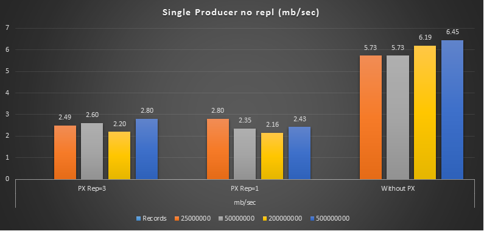

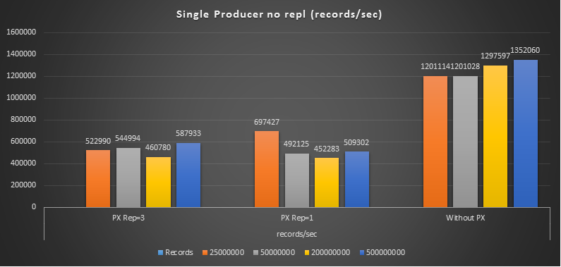

## Single Producer with Asynchronous Replication factor = 3
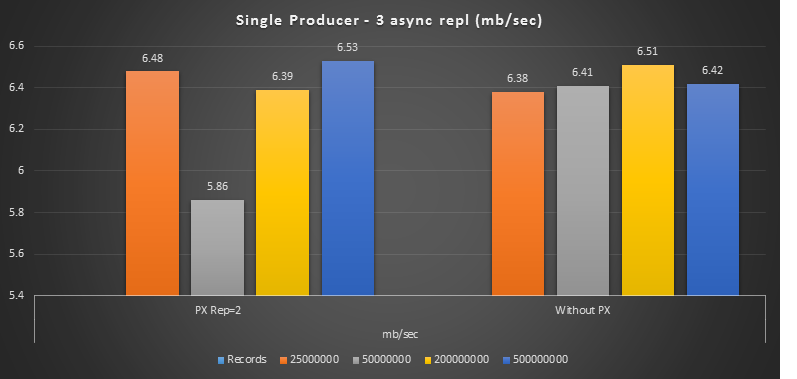

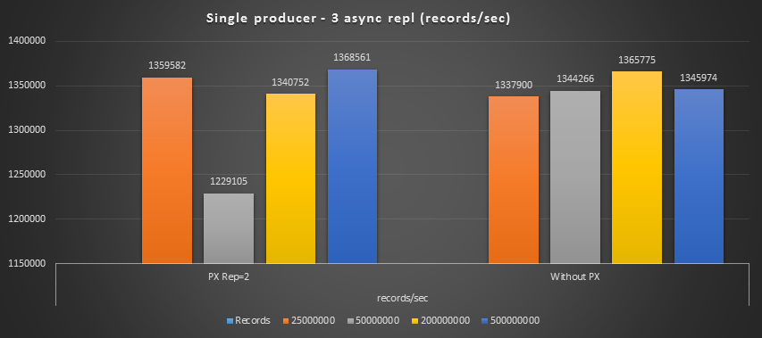

## Single producer kafka repl = 3, px repl = 1 vs px repl = 3, kafka repl = 1

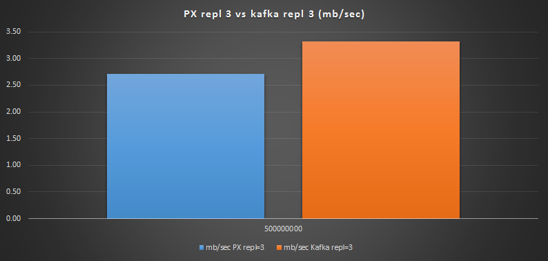

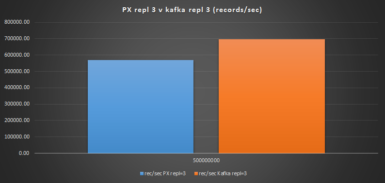

## Single Producer with Synchronous Replication factor = 3
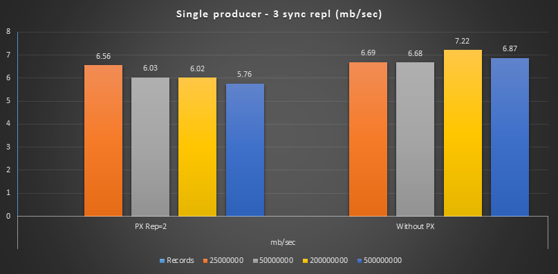

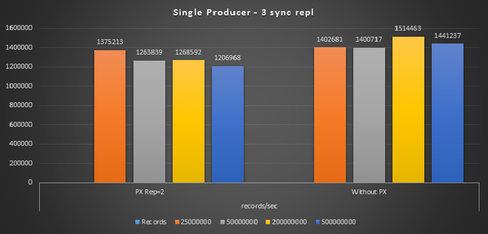

## Three Producers with Asynchronous Replication factor = 3
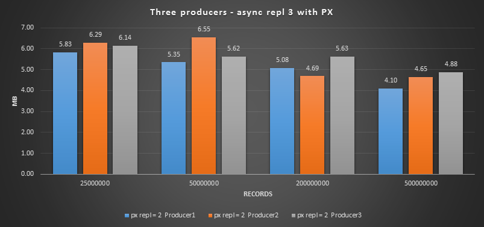
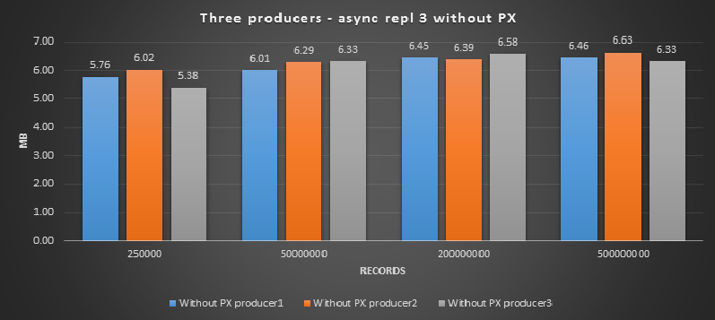

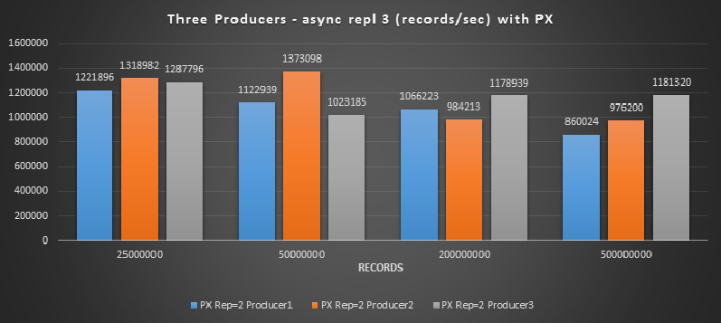
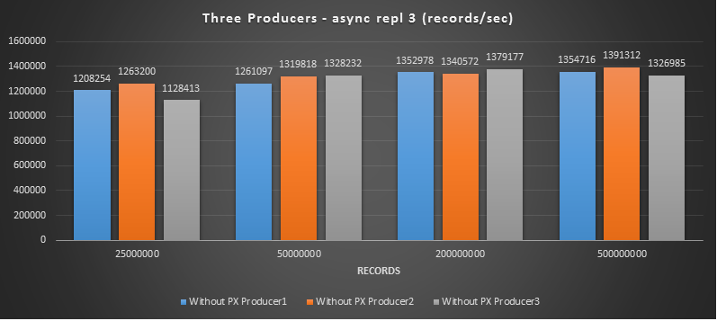


## Rebalancing

## Single Producer with Asynchronous Replication factor = 3
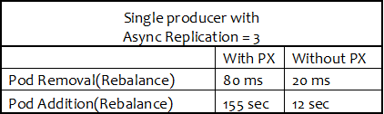

## Single Producer with Synchronous Replication factor = 3
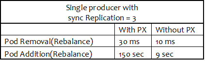

## Three Producers with Asynchronous Replication factor = 3
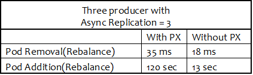

# Raw output 

## Single Producer, no replication
--------------------------------------------------------------------------------------------------------

### 25 mil (5KB Payload)
```
With PX Replication = 3 
-------------------------------------
25000000 records sent, 522990.669846 records/sec (2.49 MB/sec), 8.88 ms avg latency, 441.00 ms max latency, 1 ms 50th, 56 ms 95th, 162 ms 99th, 315 ms 99.9th.

With PX Replication = 1 (io_profile="db")
-------------------------------------
25000000 records sent, 697427.885957 records/sec (3.33 MB/sec), 9.58 ms avg latency, 507.00 ms max latency, 1 ms 50th, 58 ms 95th, 185 ms 99th, 455 ms 99.9th.

Without PX
-------------------------------------
25000000 records sent, 1201114.634381 records/sec (5.73 MB/sec), 1.24 ms avg latency, 212.00 ms max latency, 1 ms 50th, 2 ms 95th, 14 ms 99th, 26 ms 99.9th.
```

### 50 mil (5KB Payload)
```
With PX Replication = 3
-------------------------------------
50000000 records sent, 544994.768050 records/sec (2.60 MB/sec), 5.81 ms avg latency, 318.00 ms max latency, 1 ms 50th, 39 ms 95th, 100 ms 99th, 193 ms 99.9th.

With PX Replication = 1 (io_profile="db")
-------------------------------------
50000000 records sent, 492125.984252 records/sec (2.35 MB/sec), 6.81 ms avg latency, 336.00 ms max latency, 1 ms 50th, 51 ms 95th, 119 ms 99th, 196 ms 99.9th.

Without PX
-------------------------------------
50000000 records sent, 1201028.080037 records/sec (5.73 MB/sec), 1.21 ms avg latency, 245.00 ms max latency, 1 ms 50th, 2 ms 95th, 13 ms 99th, 34 ms 99.9th.
```

### 200 mil  (5KB Payload)
```
With PX replication = 3
-------------------------------------
200000000 records sent, 460780.654585 records/sec (2.20 MB/sec), 7.13 ms avg latency, 1017.00 ms max latency, 1 ms 50th, 44 ms 95th, 128 ms 99th, 514 ms 99.9th.

With PX Replication = 1 (io_profile="db")
-------------------------------------
200000000 records sent, 452283.011572 records/sec (2.16 MB/sec), 7.19 ms avg latency, 526.00 ms max latency, 1 ms 50th, 48 ms 95th, 135 ms 99th, 248 ms 99.9th.

Without PX
-------------------------------------
200000000 records sent, 1297597.498232 records/sec (6.19 MB/sec), 1.03 ms avg latency, 265.00 ms max latency, 1 ms 50th, 2 ms 95th, 7 ms 99th, 35 ms 99.9th.
```

### 500 mil (5KB Payload)
```
With PX Replication = 3 
-------------------------------------
500000000 records sent, 587933.718704 records/sec (2.80 MB/sec), 7.07 ms avg latency, 893.00 ms max latency, 1 ms 50th, 42 ms 95th, 128 ms 99th, 452 ms 99.9th.

With PX replication = 1 (io_profile="db")
-------------------------------------
500000000 records sent, 509302.927270 records/sec (2.43 MB/sec), 6.71 ms avg latency, 387.00 ms max latency, 1 ms 50th, 44 ms 95th, 125 ms 99th, 238 ms 99.9th.

Without PX
-------------------------------------
500000000 records sent, 1352060.269439 records/sec (6.45 MB/sec), 0.96 ms avg latency, 658.00 ms max latency, 1 ms 50th, 1 ms 95th, 3 ms 99th, 47 ms 99.9th.
```

## Single producer with Async Replication = 3 
--------------------------------------------------------------------------------------------------------
### 25 mil (5KB Payload)
```
With PX replication factor = 2 (io_profile="db")
-------------------------------------
25000000 records sent, 1359582.336306 records/sec (6.48 MB/sec), 22.69 ms avg latency, 1449.00 ms max latency, 2 ms 50th, 6 ms 95th, 939 ms 99th, 1420 ms 99.9th.

Without PX
-------------------------------------
25000000 records sent, 1337900.032110 records/sec (6.38 MB/sec), 1.12 ms avg latency, 231.00 ms max latency, 1 ms 50th, 2 ms 95th, 13 ms 99th, 36 ms 99.9th.
```

### 50 mil (5KB Payload)
```
With PX replication factor = 2 (io_profile="db")
-------------------------------------
50000000 records sent, 1229105.211406 records/sec (5.86 MB/sec), 115.89 ms avg latency, 2696.00 ms max latency, 1 ms 50th, 997 ms 95th, 2400 ms 99th, 2674 ms 99.9th.

Without PX
-------------------------------------
50000000 records sent, 1344266.702514 records/sec (6.41 MB/sec), 3.00 ms avg latency, 788.00 ms max latency, 1 ms 50th, 1 ms 95th, 15 ms 99th, 645 ms 99.9th.
```

### 200 mil (5KB Payload)
```
With PX replication factor = 2 (io_profile="db")
-------------------------------------
200000000 records sent, 1340752.161963 records/sec (6.39 MB/sec), 41.67 ms avg latency, 1692.00 ms max latency, 1 ms 50th, 200 ms 95th, 1071 ms 99th, 1493 ms 99.9th.

Without PX
-------------------------------------
200000000 records sent, 1365775.043193 records/sec (6.51 MB/sec), 5.80 ms avg latency, 2068.00 ms max latency, 1 ms 50th, 1 ms 95th, 27 ms 99th, 1535 ms 99.9th.
```

### 500 mil (5KB Payload)
```
With PX replication factor = 2 (io_profile="db")
-------------------------------------
500000000 records sent, 1368561.942482 records/sec (6.53 MB/sec), 31.88 ms avg latency, 1583.00 ms max latency, 1 ms 50th, 131 ms 95th, 912 ms 99th, 1386 ms 99.9th.

Without PX
-------------------------------------
500000000 records sent, 1345974.727979 records/sec (6.42 MB/sec), 4.62 ms avg latency, 1946.00 ms max latency, 1 ms 50th, 1 ms 95th, 14 ms 99th, 1176 ms 99.9th.
```
## Rebalancing

Cordon all nodes so that the kafka pod doesnt get rescheduled. Delete kafka-1 pod. It would wait in Pending state, with no nodes to run upon. 

#### Leader Election upon Pod removal With PX. 
80 ms. (Fail 2/3 nodes)
#### Leader Election upon Pod addition with PX. 
155 seconds (Recover 3/3 nodes)

Raw Output
```
[2017-09-14 20:23:37,483] INFO Partition [kbrep3-async-px2,1] on broker 1003: Expanding ISR from 1003 to 1003,1001 (kafka.cluster.Partition)
[2017-09-14 20:23:55,813] INFO Partition [kbrep3-async-px2,0] on broker 1003: Expanding ISR from 1003,1001 to 1003,1001,1002 (kafka.cluster.Partition)
[2017-09-14 20:23:55,815] INFO Partition [kbrep3-async-px2,2] on broker 1003: Expanding ISR from 1003,1001 to 1003,1001,1002 (kafka.cluster.Partition)
[2017-09-14 20:23:55,817] INFO Partition [kbrep3-async-px2,1] on broker 1003: Expanding ISR from 1003,1001 to 1003,1001,1002 (kafka.cluster.Partition)
[2017-09-14 20:26:12,241] INFO [ReplicaFetcherManager on broker 1003] Removed fetcher for partitions kbrep3-async-px2-2 (kafka.server.ReplicaFetcherManager)
[2017-09-14 20:26:12,248] INFO [ReplicaFetcherManager on broker 1003] Added fetcher for partitions List([kbrep3-async-px2-2, initOffset 166666666 to broker BrokerEndPoint(1001,kafka-0.broker.kafka.svc.cluster.local,9092)] ) (kafka.server.ReplicaFetcherManager)
[2017-09-14 20:26:12,248] INFO [ReplicaFetcherThread-0-1001]: Starting (kafka.server.ReplicaFetcherThread)
[2017-09-14 20:26:12,252] INFO [ReplicaFetcherManager on broker 1003] Removed fetcher for partitions kbrep3-async-px2-0 (kafka.server.ReplicaFetcherManager)
[2017-09-14 20:26:12,256] INFO [ReplicaFetcherThread-0-1001]: Based on follower's leader epoch, leader replied with an offset 166666666 >= the follower's log end offset 166666666 in kbrep3-async-px2-2. No truncation needed. (kafka.server.ReplicaFetcherThread)
[2017-09-14 20:26:12,256] INFO Truncating kbrep3-async-px2-2 to 166666666 has no effect as the largest offset in the log is 166666665. (kafka.log.Log)
[2017-09-14 20:26:12,257] INFO [ReplicaFetcherThread-0-1002]: Starting (kafka.server.ReplicaFetcherThread)
[2017-09-14 20:26:12,257] INFO [ReplicaFetcherManager on broker 1003] Added fetcher for partitions List([kbrep3-async-px2-0, initOffset 166666667 to broker BrokerEndPoint(1002,kafka-1.broker.kafka.svc.cluster.local,9092)] ) (kafka.server.ReplicaFetcherManager)
[2017-09-14 20:26:13,319] INFO [ReplicaFetcherThread-0-1002]: Based on follower's leader epoch, leader replied with an offset 166666667 >= the follower's log end offset 166666667 in kbrep3-async-px2-0. No truncation needed. (kafka.server.ReplicaFetcherThread)
```

#### Leader Election upon Pod removal without PX. 
20 ms. (Fail 2/3 nodes)
#### Leader Election upon Pod addition without PX. 
12 seconds (Recover 3/3 nodes)

Raw Output
```
[2017-09-14 23:01:31,862] INFO Partition [kbrep3-topic,1] on broker 1: Expanding ISR from 1 to 1,0 (kafka.cluster.Partition)
[2017-09-14 23:01:31,867] INFO Partition [kbrep3-topic,2] on broker 1: Expanding ISR from 1 to 1,0 (kafka.cluster.Partition)
[2017-09-14 23:01:31,870] INFO Partition [kbrep3-topic,0] on broker 1: Expanding ISR from 1 to 1,0 (kafka.cluster.Partition)
[2017-09-14 23:01:37,941] INFO Partition [kbrep3-topic,1] on broker 1: Expanding ISR from 1,0 to 1,0,2 (kafka.cluster.Partition)
[2017-09-14 23:01:37,946] INFO Partition [kbrep3-topic,2] on broker 1: Expanding ISR from 1,0 to 1,0,2 (kafka.cluster.Partition)
[2017-09-14 23:01:37,949] INFO Partition [kbrep3-topic,0] on broker 1: Expanding ISR from 1,0 to 1,0,2 (kafka.cluster.Partition)
[2017-09-14 23:01:41,460] INFO [ReplicaFetcherManager on broker 1] Removed fetcher for partitions kbrep3-topic-2 (kafka.server.ReplicaFetcherManager)
[2017-09-14 23:01:41,468] INFO [ReplicaFetcherManager on broker 1] Added fetcher for partitions List([kbrep3-topic-2, initOffset 166666667 to broker BrokerEndPoint(2,pdc3-sm19,9092)] ) (kafka.server.ReplicaFetcherManager)
[2017-09-14 23:01:41,468] INFO [ReplicaFetcherThread-0-2]: Starting (kafka.server.ReplicaFetcherThread)
[2017-09-14 23:01:41,471] INFO [ReplicaFetcherManager on broker 1] Removed fetcher for partitions kbrep3-topic-0 (kafka.server.ReplicaFetcherManager)
[2017-09-14 23:01:41,473] INFO [ReplicaFetcherThread-0-2]: Based on follower's leader epoch, leader replied with an offset 166666667 >= the follower's log end offset 166666667 in kbrep3-topic-2. No truncation needed. (kafka.server.ReplicaFetcherThread)
[2017-09-14 23:01:41,473] INFO Truncating kbrep3-topic-2 to 166666667 has no effect as the largest offset in the log is 166666666. (kafka.log.Log)
[2017-09-14 23:01:41,476] INFO [ReplicaFetcherManager on broker 1] Added fetcher for partitions List([kbrep3-topic-0, initOffset 166666667 to broker BrokerEndPoint(0,pdc3-sm18,9092)] ) (kafka.server.ReplicaFetcherManager)
[2017-09-14 23:01:41,476] INFO [ReplicaFetcherThread-0-0]: Starting (kafka.server.ReplicaFetcherThread)
[2017-09-14 23:01:41,480] INFO [ReplicaFetcherThread-0-0]: Based on follower's leader epoch, leader replied with an offset 166666667 >= the follower's log end offset 166666667 in kbrep3-topic-0. No truncation needed. (kafka.server.ReplicaFetcherThread)
[2017-09-14 23:01:41,480] INFO Truncating kbrep3-topic-0 to 166666667 has no effect as the largest offset in the log is 166666666. (kafka.log.Log)
```

## Single producer kafka vs px repl 
--------------------------------------------------------------------------------------------------------
### 500 mil (5KB Payload)
```
Kafka repl = 3, px repl = 1
500000000 records sent, 696845.658442 records/sec (3.32 MB/sec), 16.98 ms avg latency, 1298.00 ms max latency, 1 ms 50th, 93 ms 95th, 248 ms 99th, 942 ms 99.9th.

Kafka repl = 1, px repl = 3
500000000 records sent, 568795.212109 records/sec (2.71 MB/sec), 7.80 ms avg latency, 507.00 ms max latency, 1 ms 50th, 55 ms 95th, 142 ms 99th, 248 ms 99.9th.
```

## Single producer with sync Replication = 3 
--------------------------------------------------------------------------------------------------------
### 25 mil (5KB Payload)
```
With PX replication factor = 2 (io_profile="db")
-------------------------------------
25000000 records sent, 1375213.158039 records/sec (6.56 MB/sec), 8.05 ms avg latency, 323.00 ms max latency, 5 ms 50th, 17 ms 95th, 81 ms 99th, 266 ms 99.9th.

Without PX
-------------------------------------
25000000 records sent, 1402681.927846 records/sec (6.69 MB/sec), 4.30 ms avg latency, 169.00 ms max latency, 4 ms 50th, 6 ms 95th, 18 ms 99th, 30 ms 99.9th.
```

### 50 mil (5KB Payload)
```
With PX replication factor = 2 (io_profile="db")
-------------------------------------
50000000 records sent, 1263839.037460 records/sec (6.03 MB/sec), 16.52 ms avg latency, 792.00 ms max latency, 5 ms 50th, 20 ms 95th, 444 ms 99th, 695 ms 99.9th.

Without PX
-------------------------------------
50000000 records sent, 1400717.167190 records/sec (6.68 MB/sec), 4.06 ms avg latency, 183.00 ms max latency, 4 ms 50th, 5 ms 95th, 17 ms 99th, 33 ms 99.9th.
```

### 200 mil (5KB Payload)
```
With PX replication factor = 2 (io_profile="db")
-------------------------------------
200000000 records sent, 1268592.813422 records/sec (6.05 MB/sec), 42.10 ms avg latency, 2829.00 ms max latency, 5 ms 50th, 106 ms 95th, 1158 ms 99th, 2623 ms 99.9th.

Without PX
-------------------------------------
200000000 records sent, 1514463.122823 records/sec (7.22 MB/sec), 4.86 ms avg latency, 452.00 ms max latency, 4 ms 50th, 6 ms 95th, 18 ms 99th, 192 ms 99.9th.
```

### 500 mil (5KB Payload)
```
With PX replication factor = 2 (io_profile="db")
-------------------------------------
500000000 records sent, 1206986.035172 records/sec (5.76 MB/sec), 28.49 ms avg latency, 1843.00 ms max latency, 5 ms 50th, 104 ms 95th, 673 ms 99th, 1503 ms 99.9th

Without PX
-------------------------------------
500000000 records sent, 1441237.850365 records/sec (6.87 MB/sec), 8.46 ms avg latency, 2315.00 ms max latency, 4 ms 50th, 6 ms 95th, 25 ms 99th, 1197 ms 99.9th.
```

## Rebalancing

Cordon all nodes so that the kafka pod doesnt get rescheduled. Delete kafka-1 pod. It would wait in Pending state, with no nodes to run upon. 

#### Leader Election upon Pod removal With PX. 
30 ms. (Fail 2/3 nodes)
#### Leader Election upon Pod addition with PX. 
150 seconds (Recover 3/3 nodes)

Raw Output. 
```
[2017-09-14 18:55:15,455] INFO Partition [kbrep3-async-px2,1] on broker 1003: Expanding ISR from 1003,1002 to 1003,1002,1001 (kafka.cluster.Partition)
[2017-09-14 18:57:50,348] INFO [ReplicaFetcherManager on broker 1003] Removed fetcher for partitions kbrep3-async-px2-0 (kafka.server.ReplicaFetcherManager)
[2017-09-14 18:57:50,353] INFO [ReplicaFetcherManager on broker 1003] Added fetcher for partitions List([kbrep3-async-px2-0, initOffset 166666667 to broker BrokerEndPoint(1001,kafka-0.broker.kafka.svc.cluster.local,9092)] ) (kafka.server.ReplicaFetcherManager)
[2017-09-14 18:57:50,354] INFO [ReplicaFetcherThread-0-1001]: Starting (kafka.server.ReplicaFetcherThread)
[2017-09-14 18:57:50,357] INFO [ReplicaFetcherManager on broker 1003] Removed fetcher for partitions kbrep3-async-px2-1 (kafka.server.ReplicaFetcherManager)
[2017-09-14 18:57:50,360] INFO [ReplicaFetcherManager on broker 1003] Added fetcher for partitions List([kbrep3-async-px2-1, initOffset 166666666 to broker BrokerEndPoint(1002,kafka-1.broker.kafka.svc.cluster.local,9092)] ) (kafka.server.ReplicaFetcherManager)
[2017-09-14 18:57:50,360] INFO [ReplicaFetcherThread-0-1002]: Starting (kafka.server.ReplicaFetcherThread)
[2017-09-14 18:57:50,360] INFO [ReplicaFetcherThread-0-1001]: Based on follower's leader epoch, leader replied with an offset 166666667 >= the follower's log end offset 166666667 in kbrep3-async-px2-0. No truncation needed. (kafka.server.ReplicaFetcherThread)
[2017-09-14 18:57:50,360] INFO Truncating kbrep3-async-px2-0 to 166666667 has no effect as the largest offset in the log is 166666666. (kafka.log.Log)
```

### Leader Election upon Pod failure without PX. 
10 ms. (Fail 2/3 nodes)
#### Leader Election upon Pod addition without PX. 
9 seconds (Recover 3/3 nodes)


## Three producers with async Replication = 3 
--------------------------------------------------------------------------------------------------------

### 25 mil (5KB Payload)
```
With PX replication factor = 2 (io_profile="db")
-------------------------------------
Producer 1 
8333333 records sent, 1221896.334311 records/sec (5.83 MB/sec), 3.11 ms avg latency, 215.00 ms max latency, 1 ms 50th, 4 ms 95th, 57 ms 99th, 196 ms 99.9th.

Producer 2 
8333333 records sent, 1318982.747705 records/sec (6.29 MB/sec), 5.15 ms avg latency, 222.00 ms max latency, 1 ms 50th, 11 ms 95th, 147 ms 99th, 213 ms 99.9th.

Producer 3 
8333333 records sent, 1287796.785659 records/sec (6.14 MB/sec), 2.19 ms avg latency, 172.00 ms max latency, 2 ms 50th, 4 ms 95th, 16 ms 99th, 38 ms 99.9th.

Without PX 
-------------------------------------
Producer 1 
8333333 records sent, 1208254.748441 records/sec (5.76 MB/sec), 0.97 ms avg latency, 169.00 ms max latency, 1 ms 50th, 1 ms 95th, 9 ms 99th, 22 ms 99.9th.

Producer 2 
8333333 records sent, 1263200.394119 records/sec (6.02 MB/sec), 0.92 ms avg latency, 113.00 ms max latency, 1 ms 50th, 2 ms 95th, 6 ms 99th, 16 ms 99.9th.

Producer 3
8333333 records sent, 1128413.405552 records/sec (5.38 MB/sec), 0.93 ms avg latency, 200.00 ms max latency, 1 ms 50th, 2 ms 95th, 10 ms 99th, 18 ms 99.9th.
```

### 50 mil (5KB Payload)
```
With PX replication factor = 2 (io_profile="db")
-------------------------------------
Producer 1 
16666666 records sent, 1122939.361272 records/sec (5.35 MB/sec), 14.06 ms avg latency, 907.00 ms max latency, 1 ms 50th, 9 ms 95th, 261 ms 99th, 365 ms 99.9th.

Producer 2 
16666666 records sent, 1373098.203987 records/sec (6.55 MB/sec), 10.98 ms avg latency, 485.00 ms max latency, 2 ms 50th, 140 ms 95th, 416 ms 99th, 482 ms 99.9th.

Producer 3
16666666 records sent, 1023185.339800 records/sec (4.88 MB/sec), 9.00 ms avg latency, 488.00 ms max latency, 2 ms 50th, 104 ms 95th, 385 ms 99th, 462 ms 99.9th.

Without PX 
-------------------------------------
Producer 1 
16666666 records sent, 1261097.608959 records/sec (6.01 MB/sec), 1.18 ms avg latency, 178.00 ms max latency, 1 ms 50th, 1 ms 95th, 12 ms 99th, 40 ms 99.9th.

Producer 2
16666666 records sent, 1319818.340196 records/sec (6.29 MB/sec), 1.61 ms avg latency, 114.00 ms max latency, 1 ms 50th, 1 ms 95th, 26 ms 99th, 73 ms 99.9th.

Producer 3
16666667 records sent, 1328232.945489 records/sec (6.33 MB/sec), 1.88 ms avg latency, 162.00 ms max latency, 1 ms 50th, 2 ms 95th, 58 ms 99th, 90 ms 99.9th.
```

### 200 mil (5KB Payload)
```
With PX replication factor = 2 (io_profile="db")
-------------------------------------
Producer 1 
66666666 records sent, 1066223.107187 records/sec (5.08 MB/sec), 77.34 ms avg latency, 2731.00 ms max latency, 2 ms 50th, 596 ms 95th, 1704 ms 99th, 2566 ms 99.9th.

Producer 2
66666666 records sent, 984213.210110 records/sec (4.69 MB/sec), 478.52 ms avg latency, 4664.00 ms max latency, 2 ms 50th, 2758 ms 95th, 4263 ms 99th, 4614 ms 99.9th.

Producer 3
66666666 records sent, 1178939.414303 records/sec (5.62 MB/sec), 82.12 ms avg latency, 2727.00 ms max latency, 2 ms 50th, 601 ms 95th, 1806 ms 99th, 2602 ms 99.9th.

Without PX 
-------------------------------------
Producer 1 
66666667 records sent, 1352978.589114 records/sec (6.45 MB/sec), 3.47 ms avg latency, 607.00 ms max latency, 1 ms 50th, 2 ms 95th, 51 ms 99th, 519 ms 99.9th.

Producer 2
66666666 records sent, 1340572.411020 records/sec (6.39 MB/sec), 2.37 ms avg latency, 606.00 ms max latency, 1 ms 50th, 1 ms 95th, 18 ms 99th, 491 ms 99.9th.

Producer 3 
66666666 records sent, 1379177.169101 records/sec (6.58 MB/sec), 2.84 ms avg latency, 594.00 ms max latency, 1 ms 50th, 2 ms 95th, 26 ms 99th, 434 ms 99.9th.
```


### 500 mil (5KB Payload)
```
With PX replication factor = 2 (io_profile="db")
-------------------------------------
Producer 1 
166666666 records sent, 860024.180440 records/sec (4.10 MB/sec), 127.09 ms avg latency, 4567.00 ms max latency, 1 ms 50th, 534 ms 95th, 1148 ms 99th, 1434 ms 99.9th.

Producer 2 
166666666 records sent, 976200.234288 records/sec (4.65 MB/sec), 664.37 ms avg latency, 6395.00 ms max latency, 1 ms 50th, 405 ms 95th, 2411 ms 99th, 4349 ms 99.9th.

Producer 3 
166666666 records sent, 1181320.948364 records/sec (5.63 MB/sec), 116.61 ms avg latency, 4566.00 ms max latency, 1 ms 50th, 92 ms 95th, 959 ms 99th, 1447 ms 99.9th.


Without PX 
-------------------------------------
Producer 1 
166666666 records sent, 1354716.167996 records/sec (6.46 MB/sec), 14.64 ms avg latency, 1872.00 ms max latency, 1 ms 50th, 2 ms 95th, 429 ms 99th, 1171 ms 99.9th.

Producer 2
166666666 records sent, 1391312.085215 records/sec (6.63 MB/sec), 16.93 ms avg latency, 1881.00 ms max latency, 1 ms 50th, 2 ms 95th, 389 ms 99th, 1212 ms 99.9th.

Producer 3
166666666 records sent, 1326985.031609 records/sec (6.33 MB/sec), 40.05 ms avg latency, 5028.00 ms max latency, 1 ms 50th, 58 ms 95th, 1332 ms 99th, 1791 ms 99.9th.
```

## Rebalancing

Cordon all nodes so that the kafka pod doesnt get rescheduled. Delete kafka-1 pod. It would wait in Pending state, with no nodes to run upon. 

#### Leader Election upon Pod removal With PX. 
35ms (Fail 2/3 nodes)
#### Leader Election upon Pod addition with PX. 
129 seconds (Recover 3/3 nodes)

### Leader Election upon Pod failure without PX. 
18 ms. (Fail 2/3 nodes)
#### Leader Election upon Pod addition without PX. 
13 seconds (Recover 3/3 nodes)
